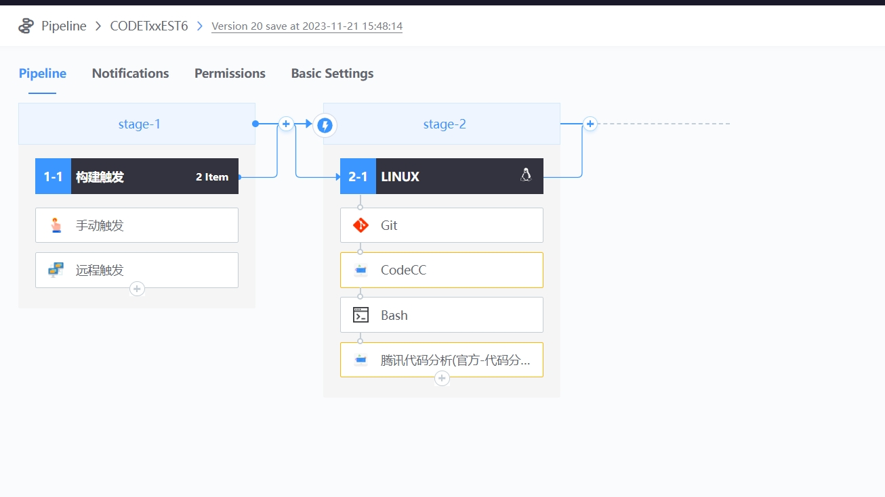
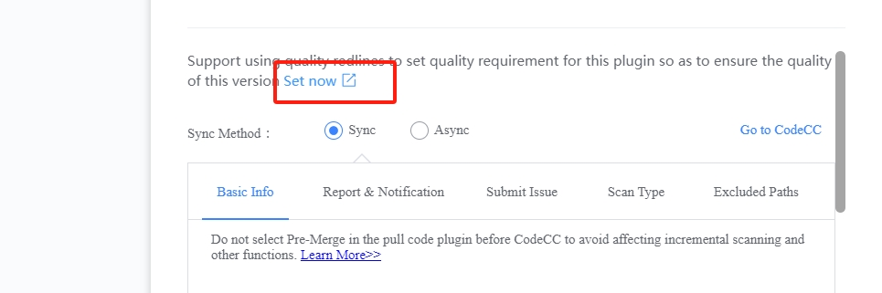
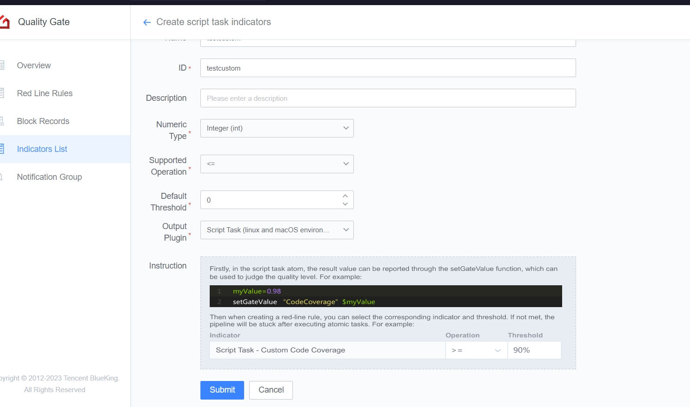
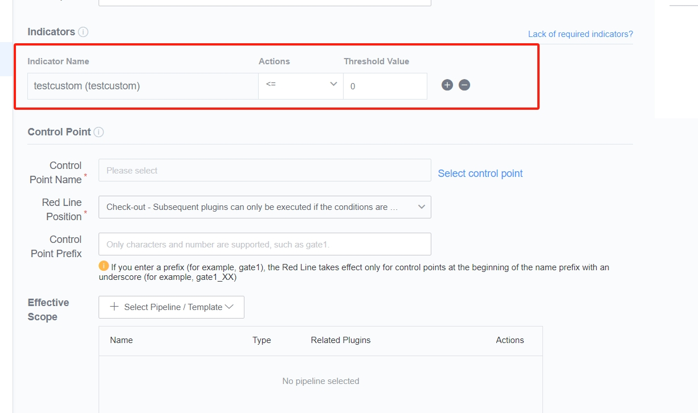

 # Use Gate at transfer/Release 

 ## Keywords: Transfer test, Release, Gate 

 ## Business Name Challenges 

 version transfer/Release is One key node in the R & D Flow.  Take the transfer test as an example, after which the dominant Role changes from Develop to Test, and the Code is generally no longer Allow to be modify at will.  Therefore, the quality control of this node is very important, generally unit Test, auto test cases, defects and Safety issues Code Analysis, etc.  If the Code Overwrite rate is too low, the execution of auto use cases fails, and there are too many Code Analysis Alert, it Description that the Code Quality is worrying and it is not appropriate to transfer the test. 

 ## Advantages of BK-CI 

 BK-CI Gate controls the behavior of the Pipeline approve Set standard so that the output Must Meets The the specifications.  It can guarantee the quality of software products in Scene such as Git Merge Request, daily build, version transfer, and Release. 

 ## Solution 

 1. add One new Test Pipeline, including compilation, unit test, Code Analysis, Job System distribution and other atoms.  Job System distribution is the key to Test environment Deploy, where Gate need to be create. 

  
  

 2. select the corresponding Code Analysis indicator in the Gate. For example, you can select the Coverity Alert number to be cleared and the Klocwork alarm number to be cleared. 

  

 3. There is no ready-made indicator for unit Test Code Overwrite. You can customize One.  for example, the following definition One float metric called CodeCoverage. 

  

 4. At this time, this indicator can be select in the process of create the Gate.  Therefore, the create of the Gate can be complete after Other information is added. 

  

 Specific Gate requirements can also be seen in the Pipeline 

  

 5. Since the Script Task indicator needs to be reported by the user himself, One line of Code needs to be added to the corresponding script task in the Pipeline to report the value of the definition CodeCoverage.  As shown in the following figure: 

  

 6. the final execute Pipeline, you can view the red line effect.  If the Code does not Meets The the requirements, it cannot be Release to the Test environment.  click "Gate" to view what aspects do not Meets The the requirements. 

  