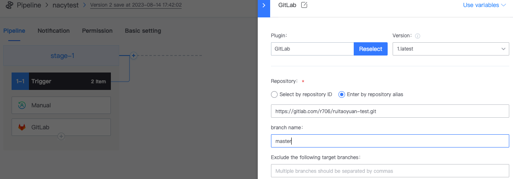
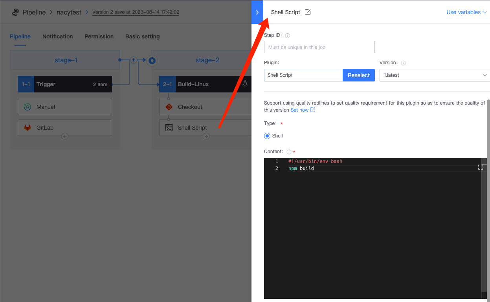

 # Enable CI for your Git project 

 ## Preparations 

 - One gitlab project 

 If not, please refer to [link your One Code Repository](Link-your-first-repo.md) 

 - One BK-CI project 
 - Understand [basic concepts and use of Pipeline](../intro/terminology/Learn-pipeline-in-5min.md) 

 ## Listening to Code Repository Push event approve BK-CI 

 1. create One blank Pipeline 
 2. To append a Triggers to Job1-1: GitLab 

    

 3. append Job2-1 to execute specific compilation Task 

    

 4. append the following 3 Plugin in turn: 

   - Checkout GitLab 

      

   - Shell Script 

      

   - Upload report 

      