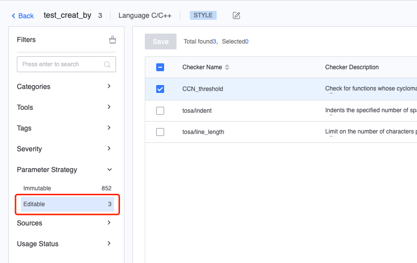
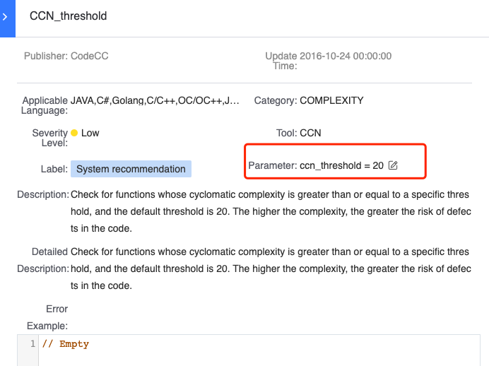
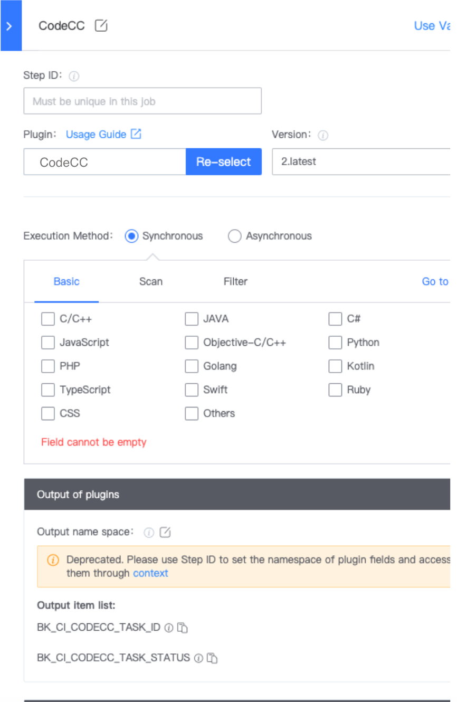
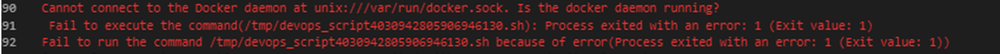

 # Code Analysis FAQ 

 ## Q1: How to setting the scanned directory after adding Blueking Code Check Center Plugin to the Pipeline? 

 Occupancy, to be supplemented 

 ## Q2: CodeCC error: Detected that this is a Self hosted agent 

  

 CodeCC does not support Self hosted agent, you can use BK-CI hosted agent to execute The Plugin 

 ## Q3: How to delete some CodeCC Task that are No Need 

 delete function is not provided. You can disable select if you do No Need Disable 

  

 ## Q4: How to use Blueking Code Check Center path Shield 

 Occupancy , to be supplemented 

 ## Q5: For std::string in some classes, we want it to be a constant const static var, but the current Code detection says no, it Must be const char\*.  I don't understand this rule. How can I find the principle behind it? 

 The cpplint rule of Blueking Code Check Center is based on the Google C++ Code specification. For more information, please see [https://google.github.io/styleguide/cppguide.html#Names\_and\_Order\_of\_Includes](https://google.github.io/styleguide/cppguide.html#Names\_and\_Order\_of\_Includes). The problem here is that fstream is used as the system header file of C++, and the include sequence should be placed before the introduction by a third party such as boost/\*. 

 ## Q6: Does Blueking Code Check Center detect Lua Code? Is it available in the default language? 

 Lua Code Analysis is not supported yet 

 ## Q7: I can't see the source code of the Code Analysis. It Display that the code fragment cannot be obtained. Please make sure that you have auth on the Code Repository and The file has not been deleted from the code base. 

  

 1. Confirm that you have "view" and "Use" auth for The Code Repository 
 2. Pull Code using Checkout gitlab Plugin 

  

 ## Q8: Can I customize or Revise the rules of Blueking Code Check Center, such as adding some name checks on my side 

 Rules in Blueking Code Check Center do not support customize, and only a few rules can Revise Parameter 

  

  

 ## Q9: When Increment scanning is setting for Code Analysis, code inspection failed after a new BK-CI hosted agent is used 

  

 When switching the agent, you need to perform One full scan first, and gitlab checkout select fresh checkout mode 

 # Q10: Blueking Code Check Center Plugin engineering language Display empty 

  

 The issue is a BUG in Blueking Code Check Center below version 1.8.  It is recommended to use version 1.8+ of Blueking Code Check Center. 

 ## Q11: Blueking Code Check Center Error view Code 

  

 The Code checked Blueking Code Check Center Must be Pull using the checkout Plugin. 

 The Code file in the error section Here was Pull using a shell Script.  Blueking Code Check Center is not Identify. 

 ## Q12: Blueking Code Check Center check takes a long time (15h+), and then an error is reported 

  

After checking the log, the error shown in the figure above is found. The reason is that the corresponding 127.0.0.1 resolution is not written in the /etc/resolv.conf file of the codecc machine.

After adding the analysis, it can return to normal.

 Both BK-CI and Blueking Code Check Center service rely on parsing. If the resolv.conf file is frequently Reduction due to restart or other reasons, it is recommended to lock the lock command. ：
 sed -i "/\[main\]/a\dns=none" /etc/NetworkManager/NetworkManager.conf

## Q13：Cannot connect to the Docker

 By default, Blueking Code Check Center Run in the BK-CI hosted agent docker environment. 

 Please check whether the BK-CI hosted agent has enable the docker service normal. 
