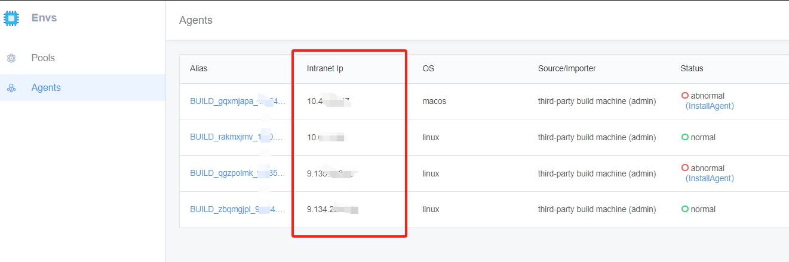
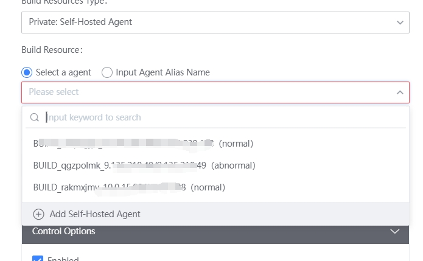

 1. + ## Q1 agent node import Error 

     Cannot execute binary file 

     ​ 	 Solution: The Develop environment does not match the command, and different environments correspond to different commands.  You cannot execute macOS or Linux commands on a Windows machine. 

      

     --- 

     ## Q2 Pools node Agent abnormal 

     Third-party machine agent abnormal 

     1. signIn the machine to view if there is a devops process: 

        + Open process management in Windows view devopsDaemon and devopsAgent processes; 

        + Mac or Linux execute the command ps -ef directly on the machine| grep devops view if there are two devops processes 

          

     2. 

        + If the devops process does not exist, cd to the agent directory (the agent directory is the directory where the install was performed) and execute the start Script; 
        + If the devops process exists, manual kill the process, make sure there is no devops process, and then execute the start Script 

     --- 

     ## failed to install BK-CI agent on Windows build machine in Q3. Subdirectory or file already exists. Access refuse 

      

     This situation is usually caused by user repeatedly install BK-CIagent. You can first execute the uninstall Script to uninstall the current agent, then delete the installation directory of The agent, and then Re-download the agent package again and install it again 

     ## BK-CI Cannot Read node After RUNNING in Q4 

     If the node cannot be refreshed after you execute the Agent installCommand and clickToRefresh, follow these step to troubleshoot: 

      

     1. Check whether the agent is installSuc. If it failed: 

     - 1.1 Make sure the target machine is a devnet machine, or you can Test the network connectivity to see if it works. 

     - 1.2 Make sure to remove the machine proxy 

      

     2. Check that the copy command is consistent with the system of the target machine 

      

     3. Make sure the installCommand is copy approve click the red box button below 

      

     **If the agent has been import into the target machine and the installCommand is copy from the imported agent node page, the node cannot be flushed out.** 

     --- 

     ## Error Reporting When Q5 CVMs Access a Third-Party intranet 

     Problem detail: Failed to connect to intranet.com port XX: Connection refused 

     example: 

     1. Failed to connect to xx.xx.com port XX: Connection refused 

     2. The machine cannot access the intranet 

     Solution: If the machine is setting a public network proxy, you need to Set the noproxy value to access the third-party intranet service. Print the value of no_proxy and append the private network to be accessed to the value 

      

     --- 

     ## In Q6, when the Windows machine Start Up the agent, it prompts "The service cannot be started due to signIn failed" 

      

     Solution: 

     Please Update your password to signIn service 

     The Update method is as follows: 

     execute the command services.msc to open the windows service Manage interface and find the service landun_devops_agent 

      

     --- 

     ## Q7 environment node Attributes Are changed 

     The user installed the same Agent installCommand on multiple different machines, causing the Pools page to continuously report the information of two different machines. 

     RUNNING Note You need to use the new unique installCommand. 

     --- 

     ## Unable to obtain the LAN IP of the agent correctly in Q8 

     BK-CI cannot obtain the LAN IP of the agent, Display as 127.0.0.1 

      

     The BK-CI Pipeline drop down agent also Display 127.0.0.1 

      

     Reason: This IP is One IP randomly select by the agent from the local IP. It may be that Other agents are used and then this IP is obtained. You can check the machine agent problem and close some agent software. 
     **The Display of intranet address 12.7.0.0.1 has no effect on the use of the agent. user can use it normal** 