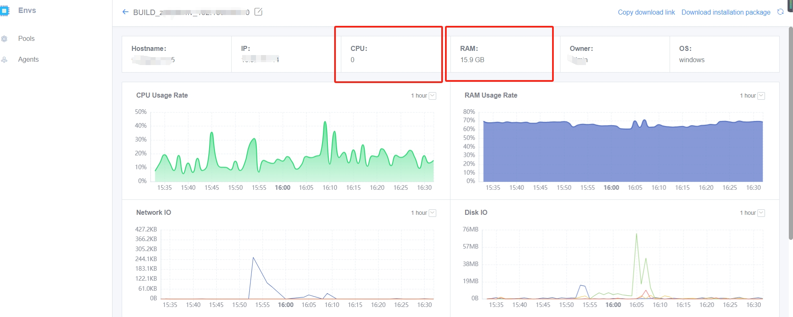

 ## Q1: How to uninstall agent 

 At present, there is no limited install directory for BK-CI agent. On windows system, the unzipped directory of agent installation package is the agent installation directory; On linux and mac system, the directory where the Agent Install Script is executed is the agent installation directory. 

 Because the install directory is not limited, after execute the agent uninstall Script (uninstall.bat for windows, uninstall.sh for linux and mac), in order to prevent accidental delete of important system file, the uninstallation script does not delete the agent-related program files, which needs to be cleaned by the user. 

 **The file/folders that need to be cleaned during agent uninstall are as follows:** 
 file: 
 .agent.properties → agent setting 
 agent.zip → Agent Install package 
 jre.zip → jre Compressed package 
 devopsAgent → agent program 
 devopsDaemon → agent daemon 
 worker-agent.jar → worker program 
 install.sh → install Script 
 uninstall.sh → uninstall Script 
 start.sh → Start Up Script 
 stop.sh → pause Script 

 **file:** 
 jre → jre 
 Log → log 
 workspace → workspace, Pipeline file Operation default Storage directory 
 runtime → Application Runtime directory 
 tmp → temporary directory 


 if that Agent Install in a separate directory, delete the agent installation directory after execute the uninstall Script.  If install in a non-standalone directory, you can delete the files yourself by following the file/folder Description above. 

 **Linux & Mac cleanup Script reference:** 
 <font color="red">**Note: You need to Confirm that no non-agent data is Storage in each folder and whether the content in workspace needs to be preserved when cleaning file**</font> 

 ``` 
 CD $install Directory 
 ./  UNINSTALL.SH 
 RM -F .AGENT.PROPERTIES AGENT.ZIP JRE.ZIP DEVOPSAGENT DEVOPSDAEMON WORKER-AGENT.JAR INSTALL.SH UNINSTALL.SH STOP.SH START.SH TELEGRAF.CONF 
 RM -RF JRE LOGS RUNTIME 
 RM -RF WORKSPACE``` 
 ``` 

 --- 

 ## Q2: How to reinstall the agent 

 **1.**   **user data Safety Precautions:** 

 Please pay attention to the installation directory when RUNNING. When execute the installCommand, the location where the current installation command is executed will be directly used as the Agent Install directory.  So we recommend that you: 

 <font color="red">**Do not install in any directory. create One directory for Agent Install, separate from user data, root directory and data disk, to avoid the impact of log data generated by Agent on your Disk space**</font> 

 

 **2.**   **Linux and MacOS system** 

 1. Enter the Agent Install directory.  The Agent Install directory can be found in **Pools → node → click "aliasName" link Enter the detail page of the agent → Basic Information → installPath**.  Since the Agent Install directory information is not collected in version before agent GO_20190612, you need to guess the installPath approve view process on the agent. The command is **ps -ef|  grep devops** 

 2. execute **./  uninstall.sh** uninstall agent(older version command./agent_uninstall.sh), and **delete the agent.zip** file.  After uninstall, Confirm that the agent process has logout. If not, you can kill the process manual. 

 3. Copy **the installation command** from the upper right corner of the detail page of the agent in Step 1 above, and execute the installation command in the Agent Install directory 

 4. Confirm that the agent process (devopsDaemon, devopsAgent) hasExisted, and check the page to view that the Agent status is normal. 

 

 **3.**   **Windows system** 

 1. Enter the Agent Install directory.  The Agent Install directory can be found in **Pools → node → click "aliasName" link Enter the detail page of the agent → Basic Information → installPath**.  Since the Agent Install directory information is not collected in the version before agent GO_20190612, you need to open the Windows Task management and view the program path of devopsAgent.exe to Confirm the installPath 

 2. execute **./uninstall.sh** uninstall agent (older version command./agent_uninstall.bat) 。  Confirm that the agent process (devopsDaemon.exe, devopsAgent.exe) has logout on the Task management after uninstall. If not, you can manual end the process. 

 3. download Installation Package from the link in the upper right corner of the agent detail page in Step 1 above

 4. Clean up Agent Install directory and only keep the **workspace** file. Unzip the installation package to the installation directory (you can also create an empty directory RUNNING). 

 5. execute./install.sh RUNNING 

 6. Confirm that the agent process (devopsDaemon.exe, devopsAgent.exe) hasExisted, and the Agent status is normal when viewed on the page 

 7. Switch Agent Install user 

 --- 

 ## Q3: How to restart agent agent 

 You can go to the install directory of BK-CIagent and execute the stop.sh Script (stop.bat batch file on windows) first, and then execute start.sh (start.bat file on windows) 


 ## Q4: Can One Mac only have one agent installed on it? Can one build machine be used by multiple project? 

 You can have more than one. You can Start Up the agent in different directories. Each agent instance needs to be completely install, and the existing agent directory cannot be copy directly. 


 ## Q5: Do Self hosted agent Must be physical machines?  Can it be a Docker container? 

 Self hosted agent and project Binding, and need to RUNNING and register. It is recommended to use Scene with few changes such as physical machines/virtual machines. Containerization uses the BK-CI hosted agent. 


 ## Q6: The detail of the agent are not Display 

  

 Not Enable. This monitoring is meaningless and does not affect Schedule.  It is recommended to use a special monitoring system such as BK Monitor. 

 If you must Enable 

 1. setting bin/03-userdef/ci.env 

 2. append BK_CI_ENVIRONMENT_AGENT_COLLECTOR_ON=true 
 3. Then append influxdb-related configItem 
 4. install ci-environment. Can be used directly./bk_install ci install 
 5. Revise existing agent: edit.agent.properties , setting devops.agent.collectorOn=true, restart agent 