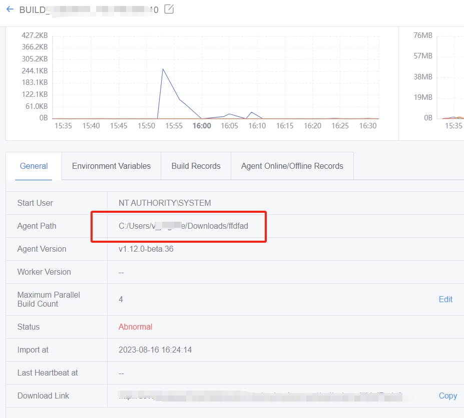
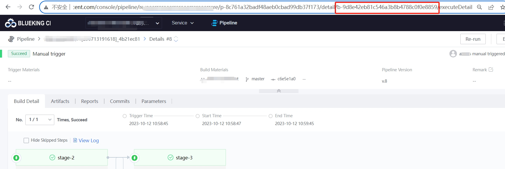

 ## Key Information for Error 

 1. CI version number currently in use 

 2. Operation Description of the problem and screenshot of the error. 

 If the error occurred on the page, please collect the page error information. 

 3. Is the problem reproducible?  Is the question casual or mandatory? 

 4. Has the problem been there all along or did it appear suddenly?  Did you do anything before it appeared? 

 5. service log. 

 6. build log. 


 --- 

 ## Build log collection 

 The build log is stored in the agent. The path for storing the build log is located at 

 **Self-hosted agent**:{agent installation directory}/logs/{buildNo} 

 **BK-CI hosted agent**:/data/bkce/logs/ci/docker/{buildNo} 


 **What is the Agent Install directory for a self-hosted agent?**: 

 BK-CI---Pools---node---{applicable agent}---installPath 

  

 **How to view the build number**: 

 In the pipeline URL, a last string starting with b- is the buildNo 

  


 ## Service Log Collection 

 Enter the CI machine 

 ```find /data/bkce/logs/ci/ -name \*-devops.log -o -name \*-devops-error.log |xargs tar zcvf /root/BK-CI-log.tar.gz```. 

 Then submit the packaged **/root/BK-CI-log.tar.gz** log 


 ## Collecting page error information 

 If you encounter a page error, the browser F12 opens the console and repeats a request operation again, and 

 Open the network label, click on the error request and take a screenshot. 

  


 Open the Console label and take a screenshot. 

  

