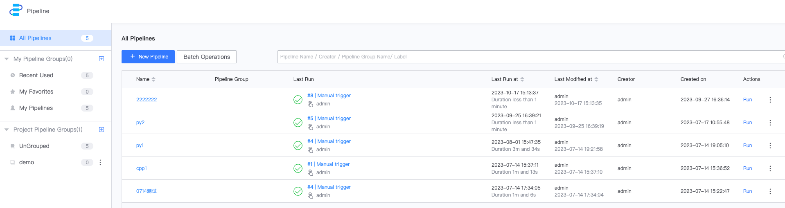
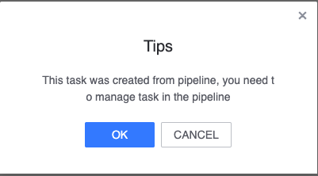
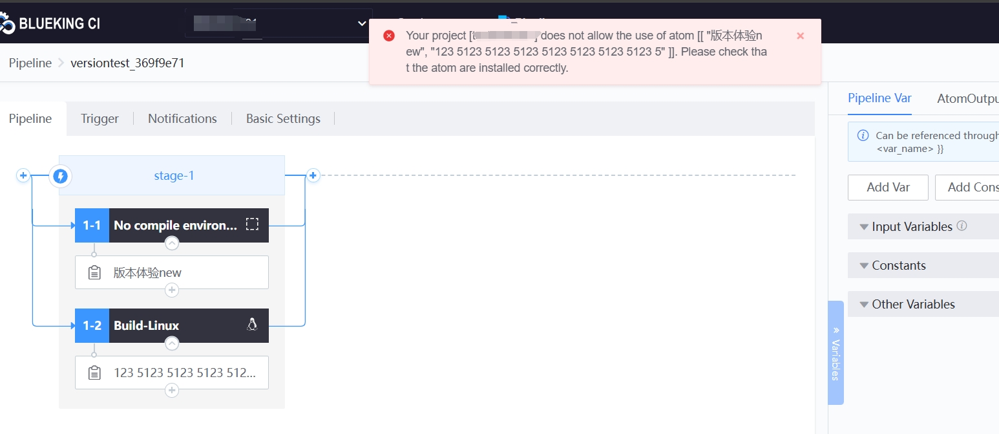

 # Known issues 

 #### Q: userGroup and customize auth overlap, resulting in user permission on Pipeline not Meets The expectations. ci <1.7 

 #### **Version: ci<1.7**&#x20; 

 Occasional/obligatory: obligatory&#x20; 

 description: The userGroup of the user has All auth of "test" project, and the customize permissions have partial Pipeline permissions of "test" project. When you Enter the pipeline page, the pipeline cannot be view **probabilistically**&#x20; 

  

  

 **Q: Gitlab occasionally failed to obtain credentials** 

  

 Known issue, **affected version <=1.5.23** 

 delete the package ticket/lib/bcprov-jdk15on-1.64.jar and restart the ticket service `systemctl restart bkci-ticket.service` 

 **Q: I want to use the unit Test report as the outputReport. The fileUploadSuccess.  But when you open the report, it cannot be Display normal, and the error "This request has haha is beenblocked; the content must be served over https」** 

  

 Known issue, **affected version: 1.5.x** 

 **Q: Three pipelineInstance are create using a template. If One is delete, the template cannot be deleted even if all the instances are deleted.** 

  

  

 Known issue, affected scope: version <**1.5.x** 

 Fixed in v1.7 

 **Q: For a CodeCC Task create approve Pipeline, if the pipeline is delete and then the code analysis task is stopped, an error will be reported** 

  

  

 Known issue, impact scope: **version 1.5.x** 

 **Q: BK-CI Output log are out of order** 

  

 Known issue, impact scope: **version 1.5.x** 

 **Q: When the BK-CI Pipeline applyPermission, I goApply, page did not location to the accessCenter. F12 view showed an error of bkiam v3 failed** 

  

  

 Known issue, impact scope: **version 1.5.x** 

 **Q: TGit Plugin is not Allow for the project. Please check whether the plug-in is install correctly** 

  

 Known problem. TGit connects with Tencent's worker bees. The use of community version is limited **, affecting version <1.5.35** 

 **** 