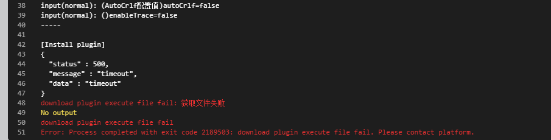
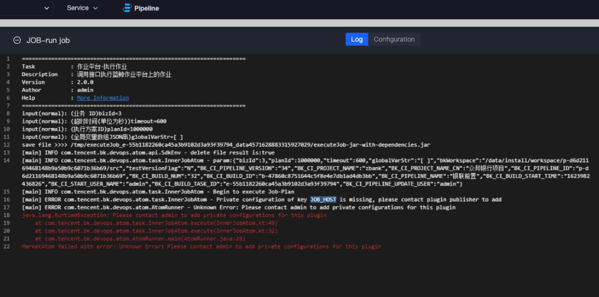
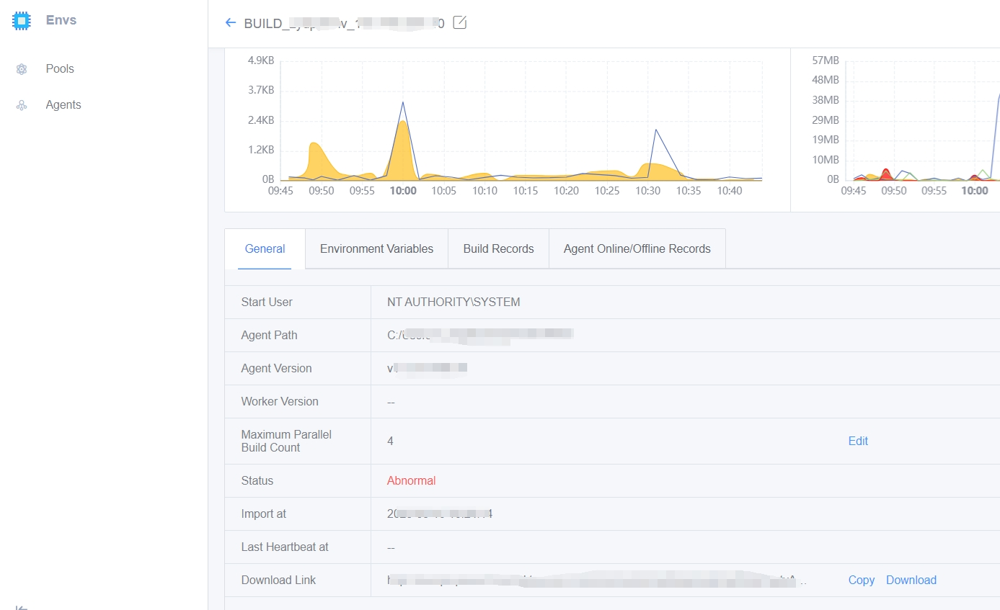

 # common problems 

 ## Q1: The plugin cannot be used after installation 

 This can be roughly divided into two situations 

 ①: After installing the plugin, there is no corresponding plugin when selecting the plugin: 

 The plugin must be installed in the corresponding project before you can select the plugin in the project.  Please refer to: 

 [Install Plugin](https://docs.bkci.net/store/plugins/plugin_install_demo#liu-an-zhuang-cha-jian) 

 ②: After the plugin is installed, the plugin status is gray, cannot be selected 

  

 Plugins are divided into compiled plugins and non-compiled plugins.  The compiled plugin is divided into three environments: Linux, Windows, MacOS 

 When adding a stage, you need to select the stage of the environment corresponding to the plugin before you can select the corresponding plugin. 

 The Job Plugin is a plugin without a compilation environment. You must select a stage without a compilation environment. 

 ## Q2: Plugin error bk_username cannot be empty 

  

 The private setting of the plugin is not configured.  For private setting methods, please refer to 

 [Plugin Private Setting](https://docs.bkci.net/store/plugins/plugin_install_demo#si-cha-jian-pei-zhi) 


 ## Q3: Download and run the plugin 

  

 This is usually caused by the MongoDB abnormal. 

 Run ``` /data/install/bkcli restart mongod``` from the central console. 

 Then check if the mongodb status is normal ``` /data/install/bkcli status mongod``` 

 --- 

 # checkout 

 ## Q1: failed to connect to gitlib.xxx.com port 443:connection timed out 

  

 The reason for the network disconnection is that after dockerhost Start Up, the command equivalent to sysctl -p is execute, causing net.ipv4.ip\_forward to be Reset to 0, causing the container to be disconnected from the network. 

```
sysctl -p | grep -F net.ipv4.ip_forward
net.ipv4.ip_forward = 0
Start a test container alone:
docker run -it --rm centos
should see
WARNING: IPv4 forwarding is disabled. Networking will not work.
Execute the command in the container, and after waiting, you will see a prompt timeout:
curl -m 3 -v paas.service.consul
Then execute systemctl restart bkci-docker-dns-redirect
Start a test container alone:
docker run -it --rm centos
Execute the command in the container, you can see the network recovery:
curl -v paas.service.consul
```

 Q2: Fetching the repository 

  

 The agent uses Ugit 

 BK-CI requires native git Pull Code.  BK-CI checkout will failed if the agent uses Ugit.  You need to install native git. 

 ## Q3: failed to obtain credentials 

  

 This is because Old Version git Pull Plugin do not support using the windows build machine, and New plug-ins do 

 ## Q4: An error is occasionally reported when Pull Code 

 Such issues can arise if a bad key is used during decryption. 

  

 ① This is a problem with the Old Version checkout Plugin, which has been fixed. 

 ② If there is still an error, it is usually caused by the inconsistent version of bcprov-jdk on the BK-CI service and the agent. 

 Please check if the version are consistent: 

 Agent: agent directory\jre\lib\ext 

 BK-CI service: /data/bkce/ci/ticket/lib/ 

 If they are inconsistent, reinstall agent agent to resolve them. 

 # Upload artifacts 

 ## Q1: No file to be Archive is match 

  

 Reason: No corresponding file is match 

 Common in the file path problems caused by the error.  When uploading, the default is to match Artifact with relative path starting from ${WORKSPACE} of BK-CI. 

 Therefore, if the corresponding Artifact is in the lower directory of ${WORKSPACE}, you need to Fill In the path/file 


 Q2: build list does not Display product 

  

 Troubleshoot logErr as insufficient space. 

 1. The/tmp directory will be used when upload, which is caused by insufficient Disk capacity in the/tmp space.  So/tmp also needs to keep enough space. 

 --- 

 # python Plugin 

 ## Q1: After Python Env Variables append, they do not Take Effect during job execute.  (Job error "The system cannot find the specified file") 

 Because the account used by BK-CI agent and BlueKing agent is system, the Env Variables added to administrator does not Take Effect. You need to add python.exe and pip3.exe pip.exe to the system environment variable, and then restart The operating system 

 ## Q2: Windows agent Pipeline runs to open exe with python 

 Under windows, the agent cannot pull up the exe with UI interface. 

 This is the Windows Session 0 Limit 

 ## Q3: Windows agent, python printing workspace failed 

 If the agent specifies a work path, for example **D:\testworkspace\source** , printing the workspace directly in python will failed. 

 Python uses\as an escape character.  Need to print as r'' 

```python
print(r'${workspace}')
```


---

 # executeJobScript 

 ## Q1: private configuration of key JOB\_HOST is missing 

  

 job Script execute Plugin link: [https://github.com/TencentBlueKing/ci-executeJobScript](https://github.com/TencentBlueKing/ci-executeJobScript) 

 The JOB\_HOST Field is missing in the Private setting. You can configure it According to shown above 

  

 # sendmail 

 ## Q1: The Email Plugin SUCCEED, but no email is received 

 1. First, setting the ESB mail information. For more information, please see: [https://bk.tencent.com/s-mart/community/question/2532](https://bk.tencent.com/s-mart/community/question/2532) 2. setting the Private configuration of the Plugin, see: [https://github.com/TencentBlueKing/ci-sendEmail](https://github.com/TencentBlueKing/ci-sendEmail) 

 ## Q2: The sender setting of the Send Email Plugin is not the sender configured by me 

  

 sender needs to be Set in the "Private setting" of the Plugin, independent of the mail\_sender of the ESB 

 1. First, setting the ESB mail information. For more information, please see: [https://bk.tencent.com/s-mart/community/question/2532](https://bk.tencent.com/s-mart/community/question/2532) 2. setting the Private configuration of the Plugin, see: [https://github.com/TencentBlueKing/ci-sendEmail](https://github.com/TencentBlueKing/ci-sendEmail) 

 ## Q3: The Plugin fails to recognize the dependency when executing 

  

 When the Plugin is execute, the pip is missing on the machine, and the corresponding dependent program needs to be install on the build machine select by the corresponding stage. 


# batchscript

 ## Q1: The batchscript Plugin cannot execute bat file, which contains var read from the system and Set by the current user 

  

 Change the startUser of the corresponding agent service to the current user, execute the command `services.msc` to open the Windows service Manage interface. Find the service `devops_agent_${agent_id}`(Note: Each agent\_id is different, and the value of agent\_id can be found in the setting file. agent.properties.) 

 Right click-> Properties, and select this account under the signIn tab 

 For instance, if it is a domain agent, Fill In `domain name\username` for the account name, for example `tencent\zhangsan`; If there is no agent in the domain, enter the account name `.\  username `, for example`.\  admin、.\  administrator、.\  bkdevops`, Input the password and click the Confirm button 

  

 Right click-> Start Up, Restart service 

  

 Open Task management, view whether the processes devopsDaemon.exe and vopsAgent.exe exist, and check whether the Start Up username of the two processes is the current signIn user 

 ## Q2: The command path in batchscript has spaces, and fail 

  

 You can enclose commands with spaces in quotation marks 

 ## Q3: When the local execute of Unity bat Script Success, BK-CI sends an error 

 After view the ** Script Execution Log **, it is found that 88 threads of UnityShaderCompiler are enable during local execution, but some UnityShaderCompilers failed to be suspended during BK-CI execution. 

 Failed to get ipc connection from UnityShaderCompiler.exe shader compiler! 

 Reason: BK-CI needs to enable processes for the used exe to collect Error and log. The number of processes create exceeds the Limit, which will cause process startup failed and Flow failure. 

 Solution: You need to increase the number of processes that the system can enable. 

 --- 

 ## Q4: Cannot execute programs with UI 

 Specific performance: the same Script in the target machine to execute the bat script no problem, in the BK-CI or job platform can not be executed 

 Explanation given by BK-CI Develop team: 

 BK-CI Self hosted agent windows agent is Start Up as system service by default. When starting a program with UI approve agent, an error will be reported or the interface will be invisible. 

 Cause: All processes Start Up by Windows Service Run in Session0, and Session0 Limit the pop-up of information windows, UI windows and other information to desktop user. 

 

 In this case, you can Start Up agent in One way, as follows: 

 1. If the agent has been install as a system service, execute uninstall.bat to uninstall agent service 

 2. Double-click devopsDaemon.exe to Start Up the agent. **Do not close the pop-up window** 


 **Note 1: The agent Start Up in this way has no boot function.** 

 **Note 2: After the BK-CIagent execute the buildTask, it will auto pause all sub-processes Start Up by the agent. If you do No Need to end the sub-processes, you can Set the Env Variables before starting the process: set DEVOPS_DONT_KILL_PROCESS_TREE=true** 

 **This is the only temporary solution at the moment, as the agent was originally designed for this purpose.** 

 --- 

 ## Q5:Batch Plugin, unable to Identify the textarea var brought back to the car 

 BK-CI is var rendering approve One render-ahead approach.  The var has been rendered, Replace the content of the Plugin. 

 The batch Plugin simulates command line execute, and when it encounters a textarea that is brought back to the car, it will be Identify as execution. 

  

 for example: 

 The batch Plugin execute   echo ${{a}} 

 The result will be equivalent to Input the following on the command line: 

 echo a b c 

 --- 

 ## Q6: Coscmd execute locally is normal, but an error occurs when using Plugin 

  

 This problem is caused by a different user when execute locally than when executing with the agent.  The user at the time of agent execute can be view approve Pools 

  

 You need to use the account that Success in local execute to reinstall the agent to make its user consistent. 

 --- 

 # Shell script 

 ## Q1: Mac OS cannot execute shell and python Plugin 

 Here's the problem: macOs 'Self hosted agent uses a shell Plugin execute a command and fails to execute any command 

  

 Using the python Plugin the following error is reported: 

  

 Troubleshooting: 

 1. Confirm whether the default shell environment of macOs normal cat /etc/shells, echo $SHELL, as Display below 

  

 2. view the agent log set up job log, view the Env Variables, and see if the environment variables are normal 

  

 In this The Case, the Env Variables LANG is found to be abnormal. It is Error to set the character set LANG to zh_CN.eucCN. It should be set to zh_CN. UTF-8 

  

 Cause: The LANG character set affects the var export of Chinese value, causing the whole sh Script to fail 

 Solution: Revise the character set to the correct character set to solve 

 ## Q2: abnormal in shell Script execute 

 Error: java.io.IOException: No such file or directory 

  

 Troubleshooting: 

 1. Check whether workspace is Set. If it is set, remove it first and then execute shell to see if it is Success. If it is successful, it is a problem with workspace setting. 

 2. Check whether the workspace directory is create in the user directory, if not, Pipeline cannot access it. 

 Cause: Workspace auth issue 

 Workaround: create the workspace location correctly and set the permissions to 