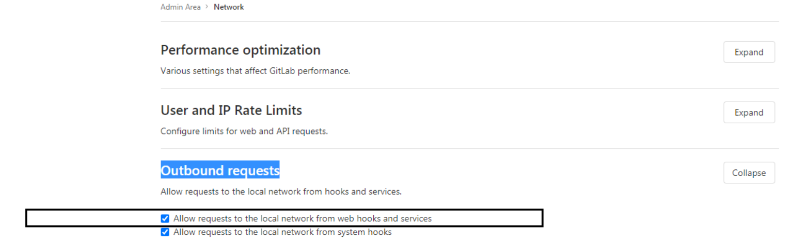
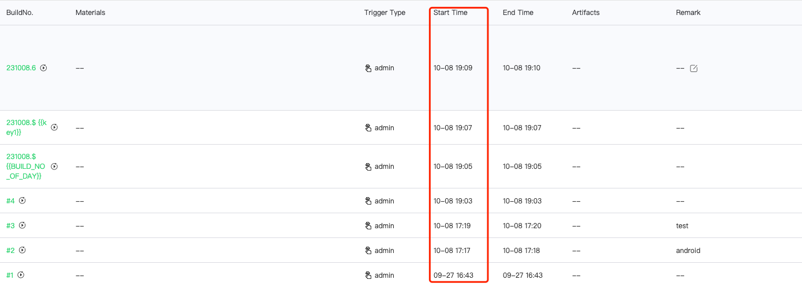

## Q1: The gitlab trigger plugin cannot trigger the pipeline

1. Check if the branch matches

2. Check the devops\_ci\_process.T\_PIPELINE\_WEBHOOK table to see if this pipeline is registered, SELECT \* FROM devops\_ci\_process.T\_PIPELINE\_WEBHOOK WHERE pipeline\_id = ${pipeline\_id}, ${ pipeline\_id} can be obtained from the url address

 3. if not register 

   1. view whether the network from repository service to gitlba can be connected, such as whether to setting gitlab domain name resolution 

   2. view whether the gitlab repository has master permissions.  The user who Generate the accessToken must be the `maintainer` Role of the repository, and the Scopes of the accesstoken must have `api` permission auth 

   3. On the machine where the repository service Deploy, execute grep "Start to add the web hook of " $BK\_HOME/logs/ci/repository/repository-devops.log to find the reason for the registration failed. The default for $BK\_HOME is/data/bkce 

 4. if it is register, 

   1. Go to the webhook page of gitlab and view whether the registration is Success, as shown in Figure 1. 

   2. If there is a registered url in gitlab, the url is [http://domain/external/scm/codegit/commit](http://xn--eqrt2g/external/scm/codegit/commit) and edit to view View detail, as shown in Figure 2 

   3. view the Error detail sent, as shown in Figure 3.  Check whether the network from gitlab to BK-CI machine is reachable, such as whether the gitlab service can resolve the BK-CI domain name. 

 5. If all the above are correct, on the machine where the process service Deploy, execute grep "Trigger gitlab build" $BK\_HOME/logs/ci/process/process-devops.log to search for the log of the triggered entry and view the Request body pushed by gitlab. 

   view the Request body pushed by gitlab and Compared whether the `http_url` Field in the request body **completely** match the address of the code repository in the Code Repository. If One is a URL in the form of domain name and the other is a URL in the form of IP, they do not match.  As shown in Figure 4 and Figure 5 

 Gitlab's hook log shows an error: Hook execution failed. 

 This is because gitlab 10.6 does not allow webhooks to be sent to the local network by default for security reasons.  You need to enable the gitlab security limit. 

  

  

 ## Q3: gitlab webhook error 

 URL '[**http://devops.bktencent.com/ms/process/api/external/scm/gitlab/commit**](http://devops.bktencent.com/ms/process/api/external/scm/gitlab/commit)' is blocked: Host unresolvable or invalid 

 gitlab could not resolve the domain name of BK-CI. 

 You need to set the host resolution for devops.bktencent.com on your gitlab machine. 

 ## Q4: Occasional webhook triggers do not take effect 

 After checking the log, it is found that the amount of pipeline exceeds the limit of 50 concurrent tasks. 

  

 Update devops_process.T_PIPELINE_SETTING set MAX_CON_RUNNING_QUEUE_SIZE=100 where PIPELINE_ID='${pipeline_id}'; It is recommended that the maximum not exceed 100. 

 ## Q5: The Pipeline Scheduled Trigger Time display is wrong, and the trigger time is also wrong. 

  The requested URL was not found on this server normally. 