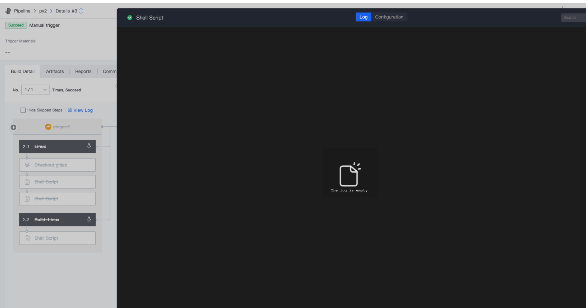
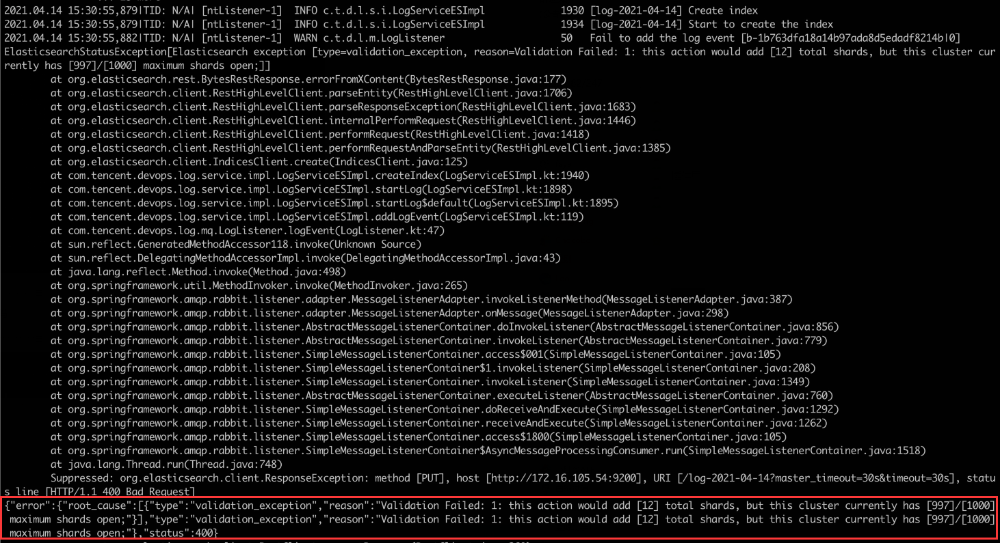

 # Pipeline runs common Error 

 ## Q1: While the Pipeline is running, the build log of unity is not Display in Real time 

 The reason is that "the Script first execute the unity compilation build Operation, and at the same time writes the log to the file, but before The operation ends, the subsequent cat command will not be executed, resulting in the log not being Display on the web page in Real time." For this Scene, try the following workarounds: 

 ```  nohup $UNITY_PATH -quit -batchmode -projectPath $UNITY_PROJECT_PATH -logFile $UNITY_LOG_PATH -executeMethod CNC.Editor.PackageBuilderMenu.BuildPC "${isMono} ${isDevelop} $UNITY_OUT_PATH" & echo $! > /tmp/unity_${BK_CI_BUILD_ID}.pid unity_main_pid=$(cat /tmp/unity_${BK_CI_BUILD_ID}.pid) tail -f --pid ${unity_main_pid} $UNITY_LOG_PATH ``` 

 --- 

 ## Q2:CI does not Display log 

  

 The requested log was not found on this server. 

  

 One index that accounts for 12 shards exceeds the Maximum shards Set by es7, which is the Limit of es7 

 Solution: Clean up some useless indexes 

 source /data/install/utils.fc curl -s -u elastic:$BK_ES7_ADMIN_PASSWORD -X GET http://$BK_ES7_IP:9200/_cat/indices?  v delete index # index is the index name curl -s -u elastic:$BK_ES7_ADMIN_PASSWORD -X DELETE http://$BK_ES7_IP:9200/index #Note: Cannot delete.security-7 ``` 

  

 **One possibility is that the user does not have es7 installed** 


 ## Q3: Plugin stuck for a long time in a buildTask 

 The default Timeout of the Plugin is 900 min. If the plug-in does not terminate after the timeout, an abnormal occurs in the process or project service. 

 You need to Enter the BK-CI machine and Restart service 

 ```systemctl status bkci-project.service ``` 

 ```systemctl status bkci-process.service``` 

 --- 

 ## Q4: Build is not canceled or Response Time is too long after manually cancelBuild 

 Common causes are: 

 1. After the BK-CI version is updated, if the client agentVersion is not updated accordingly.  May cause this problem. 
 2. Confirm that the var DEVOPS_DONT_KILL_PROCESS_TREE has been append to the machine. 
 3. If the problem occurs occasionally, the BK-CI process may occasionally fail due to excessive resources usage.  You can try to restart the process. 
 4. The agent receives the process terminate signal slowly due to network and resources problems.  The agent resources and network can be checked. 


 ## Q5: Remote API triggers Pipeline remotely, Display Without permission 2101008 

  

 The Remote triggers execute the pipeline as the user who last save Pipeline. 

 If the permission of the user who save Pipeline last is cancel in the accessCenter, The pipeline cannot be execute using remote.  Other user with auth is required to save The Pipeline again. 


 ## Q6: execute start failed parallel upper limit 

  

 A single Pipeline running more than 50 Task concurrently will affect performance and may failed.  So Limit. 

 update devops_process.T_PIPELINE_SETTING set MAX_CON_RUNNING_QUEUE_SIZE=100 where PIPELINE_ID='${pipeline_id}'; It is recommended that the maximum should not exceed 100 