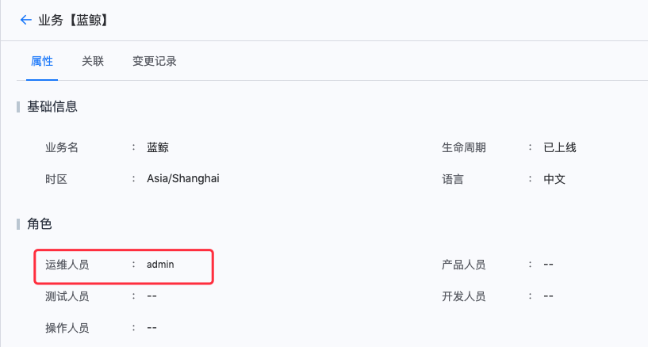

----

##  Not sure how to categorize FAQ 

 ### Q1: How does the product build by the BK-CI Pipeline support service distribution speed limit setting?  (I don't know) 

 Adjust the speed limit of distribution source, as shown in the figure below. For machines where the agent has been installed, you can remove it first and then install it. IP: 192.168.5.134 

  


 ### Q2: Can the projectName be Revise?  (Put it in the project FAQ) 

 The projectName can be modify within projectManage, the englishName (i.e. Project ID) cannot be changed. 

  

  


 ### Q3: How to auto distribute the build products to the specified service approve BK-CI?  (should be placed in example The document) 

 With the Deploy machine, we can distribute the artifactory to the Test machine.  First append One noEnv Job 3-1, Add plugin Job System distribution and complete setting. 

  


 ### Q5: Can I upload a build product to a specified Private GitLab repository approve the BK-CI Pipeline?  (should be placed in example The document) 

 BK-CIgit Plugin No data push function.  user can place the sshKey on the agent and use the git command in the Batch Script Plugin or Bash plugin to push the product to a temporary solution. 

 ### Q6: The node machine Display normal. Why is there no data in the monitoring networkIo?  (Pools) 

  

 Not Enable. This monitoring is meaningless and does not affect Schedule. It is recommended to use a special monitoring system such as BK Monitor. 

 To Enable: 

 ```
 1. setting bin/03-userdef/ci.env 
 2. append BK_CI_ENVIRONMENT_AGENT_COLLECTOR_ON=true 3. Then append the influxdb related configItem. 
 4. install ci-environment. Can be used directly./  bk_install ci install. 
 5. Revise an existing agent: edit.agent.properties , setting devops.agent.collectorOn=true, restart agent. 
 ``` 

 ### Q7: How to use docker build to package an image and then Push image to Harbor? My docker build environment does not have docker commands (I haven't figured them out yet) 

 Self hosted agent can be used. There is no dockerd in the container. For Safety reasons, the dockerd of the Host cannot be Operation in the container, or if the BK-CI consumer is trusted, we can use the DinD** solution of our delivery team ** 

 --- 

 ## Auth FAQ 

 ### Q1: Why do I sometimes need to apply Pipeline auth, but it is restore after F5 reflash?  (accessCenter) 

 There is a auth conflict. In the userGroup permission, there are permissions for multiple Pipeline. However, there is only One Pipeline auth in the customize. A later Update will fix this issue.  The workaround is to delete customize auth.  The issue will be fixed approve version Update. 

  

 ## BlueKing Related 

 ### Q1: Is there a way to call BK-CI from Standard OPS?  (BlueKing) 

 Pipeline stage-1 trigger select remote. Then the Standard OPS calls job to quickly execute the Script, and calls the URL prompted in the remote Plugin. 

 ## Image Related (store) 

 ### Q1: Error occurred when upload images. The program changed the http method to https by default (store) 


 Docker default is https, this needs to change the service docker. You need to append insecure-registry to/etc/docker/daemon.json on the dockerhost machine. 

 By default, BK-CI uses https to Push images. If you want to use http, you need to setting the repository domain name to insecure. 

 If you use https, if the repository domain name is not the certificate that corresponds to the docker client when it is installed, you need to import the certificate corresponding to this domain name in the agent 

 ### Q: Where can I view the jar packages upload to the BK-Repo?  Use default (unknown) 

 BlueKing Community Reference: [https://bk.tencent.com/s-mart/community/question/2380](https://bk.tencent.com/s-mart/community/question/2380) 

 ### Q: failed to Pull image. Error Message: status 500 (store)(agent) 

  

 user repositories, network accessibility must be ensured first 

 ### Q: No (Credential Manage) after new ticket 

 Check whether the browser has an error after create, and check whether the log of ci-auth and ci-ticket are abnormal. 

 If it was create by a Normal user, you can switch to the Administrator account to view if it was Success created. 


 ### Q: store: Plugin Config file\[task.json]atomCode Field is inconsistent with the one entered in the workbench (store) 

  

 upload, may not be Plugin Release package, is the source Code.  The Release process looks at the readme of the Plugin 

 If you are upload the correct Release package, you can temporarily edit the task.json in the plugin ZIP package, Revise atomCode(consistent with the upload interface, without underscores), and then repackage and upload. 

 ### Q: How can Business Name in the Configuration System be link with the BlueKing Container Service?  (BlueKing) 

  

  

 1. In the accessCenter, check whether the user Account has the Configuration System permission of "local-k8s". In the Configuration System, check whether The Account user in "resources-Business Name-OPS Personnel" 

  


 ### Q: Can I Revise the English Name of the project (project) 

 Revise is not supported 

 ### Q: After logging in to BK-CI in the browser, you need to log in again if you access BK-CI in different tabs of the same browser (I haven't decided yet) 

 In this case, the signIn cookie has expired. The default is two hours. The expireDate is adjustable. 

 --- 

 ### Q: The service Disk full. Can I delete these directory file (system disk)? 

  

 These are all build artifacts. Currently, there is no expired cleanup Alert Rules for build artifacts. user can delete them as appropriate 

 ### Q: How to call openapi (API) in CI version 1.5.4 

 version does not enable OpenAPI.  You can upgrade to version 1.5.30 and above, The has OpenAPI enable. 

 ### Q: How to view the information in the voucher (voucher) 

  

 For Safety reasons, The content is encryption and cannot be view 

 ### Q: Check whether the code supports lua (Blueking Code Check Center) 

 Lua is not supported for Code Analysis 

 ### Q: Can I extend the Code Analysis rules (Blueking Code Check Center) by myself? 

 Currently, the self-extension function is still In development, and the rules for self-extension Code Analysis are not supported. 

 ### Q: How to make Pipeline task optional 

 "Skip some on manual trigger" 

  

 ### Q: What is this serviceId (BlueKing) 

  

 serviceId in the Configuration System, which can also be seen in the Job System 

  

  


 ### Q: Some rules in Code Analysis are not applicable to our company. How can I Revise the rules?  （codecc） 

 The content of a rule cannot be Revise, but the Checkersets can be modified.  Code Analysis is performed by taking Checkersets as the unit. If some rules are found to be inapplicable, they can be removed from the rule set. If The rule set is the default rule set, user are not Allow to add or delete them. You can select to create a customize rule set Base on this rule set. Users can add or delete some specific rules in the created rule set 

 ### Q: Code Analysis failed. Unknown Error: Unexpected char 0x5468 at 0 in X-DEVOPS-UID value： xxx（codecc） 

  

 One step will read the gitlab fullname, Set to English to solve the problem, currently does not support the Chinese gitlab fullname, the profile username is displayed above the fullname, such as vinco huang here, you can Enter the Revise page approve the "Edit profile" here 

  


 ### Q: You can Set auth for Pipeline. For example, A can see part of the ten pipelines under One project, and B can only see the other part. You want to divide them according to their functions (BlueKing) 

 The accessCenter can Manage a single Pipeline. First, grant project permission to a specific user, and then grant permission to a single pipeline 

  

  

  

 ### Q: There is Set upper limit for the pipelinesHistory of BK-CI. My timed Pipeline may run One a minutes, data will waste Disk 

 For high-frequency Cron, it is recommended to use the operation platform of BlueKing. 

 ### Q: Ubuntu BlueKing Agent Install failed, no enough space left in /tmp, but the machine has Disk space Remaining (BlueKing) 

  

 Generally, the Ubuntu machine cannot execute the awk command normal, and the following error occurs when executing awk: 

 `awk: symbol lookup error: /usr/local/lib/libreadline.so.8: undefined symbol: UP` 

 You can refer to this method and Replace: 

  

 ### Q: Image verification Fail when link image (store)(Image) 

  

  

 The image is in a Private repository. Docker does not support private repositories other than https by default. You need to Revise on the BK-CI hosted agent, append the private repository address in the `insecure-registries` Field, and then restart the docker service 

  

 ### Q: Is there an image of BK-CI based on Ubuntu (store)(image) 

 There is no ready-made Ubuntu-based BK-CI image, user can follow the guidelines to package their own image: [https://bk.tencent.com/docs/document/6.0/129/7518](https://bk.tencent.com/docs/document/6.0/129/7518) 


 ### Q:Download artifacts Why can't I download file? 

 **1. Do not include a path when downloading** 

 for example when upload, Fill In Artifact source as dir1/test.txt, upload will only upload the file, not the directory. 

 To download, just Fill In test.txt. 


