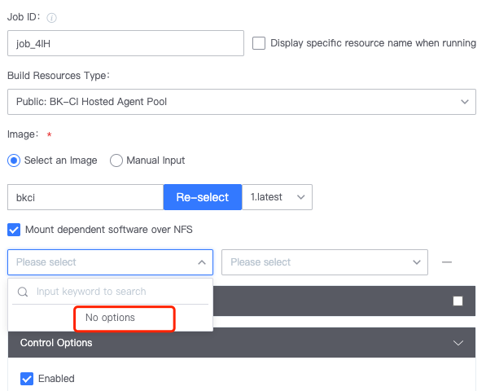

 # BK-CI hosted agent 

 ## Q1: What is Pipeline Schedule Alert Rules when there are multiple BK-CI hosted agent? 

 The Algorithm will give priority select One build machine (affinity), and if a resources of the last build machine exceeds the following Threshold, it will find another agent to buildTask 

 ```Memory Threshold: 80% diskIo: 85% Disk Space: 90% ```

 ## Q2: Can I Revise the Threshold of a Schedule Alert Rules? 

 Currently, you can only adjust the Memory Threshold. The default is 80%. That is, when the ramUsageRate of a BK-CI hosted agent reaches 80%, if Other builders have Idle resources, Task will be Schedule to other builders. This threshold can be Revise. The modification method is as follows: signIn in to the BK-CI dispatch-docker service machine and execute: 

 ``` # The value of threshold is the Threshold percentage. Here, adjust the Memory threshold to 70% as an example. curl -H 'Accept:application/json; charset="utf-8"' -H 'Content-Type:application/json; charset="utf-8"' -H "X-DEVOPS-UID: admin" -X POST --data '{"threshold":"70"}' http://127.0.0.1:21938/api/op/dispatchDocker/docker/threshold/update
 ``` 

 ## Q3: How to mount a BK-CI hosted agent? 



 This requires maintaining One NFS Shared Storage service, which is not Recommended and may be remove later 

 OK practice is to package the dependent tools into the image in two Stage 

 The job in Stage A has a task A: Is to Clone the git Code and build the compiled package jar 

 The job in Stage B has a task-B: It is to deploy OK jar scp build in task-A to the service. 

 It turns out that the two Stage of the workspace are not common.  The current practice is to put them all into One Job, so that we can share a workspace build the production jar file. 

 Design so, CI products if you want to Deploy out, you Must go to the BK-Repo, with maven private server idea is right 

 ## Q4: Which system are supported by BK-CI hosted agent? 


 The BK-CI hosted agent relies on docker and can only Run linux. At the moment you can only Run Build Image based on our bkci/ci:alpine (debian system). 

 --- 

 ## Q5: Can BK-CI hosted agent use their own images? 

 Yes, please see [https://docs.bkci.net/store/ci-images](https://docs.bkci.net/store/ci-images) 

---

 ## Q6: How to delete a BK-CI hosted agent 

 signIn in to the BK-CIdispatch-docker server, execute `/data/src/ci/scripts/bkci-op.sh list` to obtain all BK-CI hosted agent, and execute `/data/src/ci/scripts/bkci-op.sh del` 

 --- 

 #Self hosted agent 

 ## Q1: What is the Schedule Alert Rules for build a Private cluster? 

 If there are multiple Self hosted agent, a private build cluster can be formed. After select this cluster, the BK-CI Pipeline selects one of them to build According to a certain algorithm: 

 **The Algorithm is as follows:** 

 **Agent with highest Priority:** 

 1. This agent was used in a Recent buildTask 
 2. There are current no buildTask 

 **Next highest Priority agent:** 

 1. This agent was used in a Recent buildTask 
 2. There are current buildTask, but the Quantity of build tasks does not reach the maxConcurrency of the current agent 

 **Agent with the Three Priority:** 

 1. There are current no buildTask 

 **Agent with the Four Priority:** 

 1. There are current buildTask, but the Quantity of build tasks does not reach the maxConcurrency of the current agent 

 **Minimum Priority:** 

 1. None of the above conditions are met 

 --- 

 ## Q2: The BK-CI Script Start Up gradle daemon process, which is close after each build. Is it controlled by the devops agent? 

  

 Yes, it is.  After the BK-CIagent execute the buildTask, it will auto pause all sub-processes Start Up by the agent. If you do No Need to end the sub-processes, you can Set the Env Variables before starting the process: set DEVOPS\_DONT\_KILL\_PROCESS\_TREE=true. Set `setEnv "DEVOPS_DONT_KILL_PROCESS_TREE" "true"` in the bash Script. 

 --- 

 ## Q3: Can the same Self hosted agent be used by multiple project? 

 yes.  Install the agent in different directories of the Self hosted agent and import it into the corresponding project. 


 ## Q4: Can I only use a Self hosted agent to Generate images with docker build? 

 It is recommended to use a Self hosted agent. The BK-CI hosted agent DinD solution has Safety risks, so it needs a private build mechanism as an image. 

 If BK-CI consumers are trusted, they can use our delivery team's DinD **solution** 

