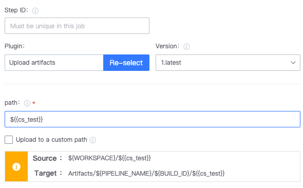
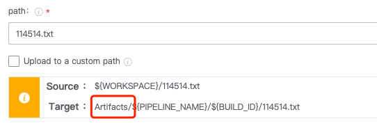

 # general problems 

 ## Q1: Obtaining and referencing Plugin value 

 click the upper right corner of the useParams, and then click on the right to copy the variable, and then paste it to where you need it 

  

 For how to define and reference customize var, please Reference document: 

 [var definition and Reference](https://docs.bkci.net/overview/terminology/variables) 

 ## Q2: definition and Obtaining var 

 Question One: How to use BK-CI var in your program 

 ```
 #Single-line python example, var is the Name definition by the user in this step or Other steps, and BK_CI_START_USER_NAME is the Global Variables python -c "import os of BK-CI; print(os.environ.get('var'))" 
 python -c "import os; print(os.environ.get('BK_CI_START_USER_NAME'))" 

 #If you know the name of the var you definition, you can also get cat in your python file approve os.envion.get ('var ')&lt;< EOF >test.py import os print(os. envion.get ('var')) EOF python test.py
 
 ``` 

 Question Two: How to write var back to BK-CI 

 ```#If it is a constant, shell can use setEnv, bat can use call:setEnv to write the var back to BK-CI setEnv "var_name" "var_value" # shell call:setEnv "var_name" "var_value" # bat 

 # Write the python Script Output result to BK-CI var_value=`python script.py` # script.py. Print output is required, such as print("test") setEnv "var_name" "${var_value}" # var_name="test" 

 # Write the var to One file, then read the file in the shell, then setEnv python script.py env.sh #Assume file_name="test.txt" in env.sh 
 source env.sh setEnv "var_name" "${file_name}" 
 ``` 

 Question Three: Call python in the bat Script and write python Output back to BK-CI 

 ````for /F %%i in('python3 D:\mytest.py') do (set res=%%i) echo %res% call:setEnv "var_name" %res%```` 

 --- 

 ## Q3: Use agent system var in Plugin 

 The system var of the agent can be obtained directly from batch and shell.  However, Other Plugin cannot read system var directly, so you need to Transformer system variables to BK-CI customVar and then use BK-CI variables in the plug-in. 

 Windows example: 

 ① Use batch Plugin to Assign the system var cs_test to the BK-CI variable. 

 ``` 
 call:setEnv "cs_test" "%cs_test%" 
 ``` 


 ② Use ${cs_test} to useParams in Other Plugin 

  


 ## Q4: How to conditionally execute Plugin 

 Each Plugin is One task. approve Advance Flow control, you can definition the Run logic of the plug-in. 

 [task Description](https://docs.bkci.net/overview/terminology/task) 


---

 # python 

 ## Q1: How to Set BK-CI var in python 

 Python Plugin cannot Set BK-CI var directly.  var can only be written approve calling the shell or bat. 

 ```
  # Write the Output result of python script back to BK-CI var_value=`python script.py` #print output is required in script.py, such as print("test") setEnv "var_name" "${var_value}" # var_name="test" 

 #Write the var to One file, then read the file in the shell, then setEnv python script.py env.sh #Assume file_name="test.txt" in env.sh 
 source env.sh setEnv "var_name" "${file_name}" 
 ``` 

 --- 

 # Upload artifacts 

 ## Q1. Where did the file go after upload? 

 After upload, the File Upload to the BK-CI service. 

 ## Q2. What are Artifacts? 

 Artifacts is the path to the BK-CI service. 

 /data/bkce/public/ci/artifactory/bk-archive/${projectName} 

 ## Q3. What is the absolute upload path of a product? 

 For example, the projectName is vincotest, and the actual storage path of 114514.txt is on the BK-CI machine: 

 /data/bkce/public/ci/artifactory/bk-archive/vincotest/${pipelineId}/${build}/114514.txt 

 The projectName, pipelineId, and build ID can all be read from the pipeline url 

  


---

# batchscript

 ## Q1: Call python in bat Script and write python Output back to BK-CI 

 ````for /F %%i in('python3 D:\mytest.py') do (set res=%%i) echo %res% call:setEnv "var_name" %res%```` 

 --- 

 # shell 

 ## Q1: echo $HOME in the Plugin is empty 

 1. restart the BK-CI agent, which is related to the system Start Up sequence. 

 2. You can also temporarily write this Env Variables in the Pools. 

  


 # checkout 

 ## Q1: Why can't the checkout Plugin Pull the latest Code? 

 After troubleshooting, The Plugin has a retry Operation. 

 The commit version has been Confirm during the One checkout Pull. 
 Subsequent retry the Plugin will pull the Version (s) of the Code.  Even if there is a new commit, it will not be detected on retry. 

 If you need to Start Up One build, it will recheck the latest commit and Pull latest Code. 
