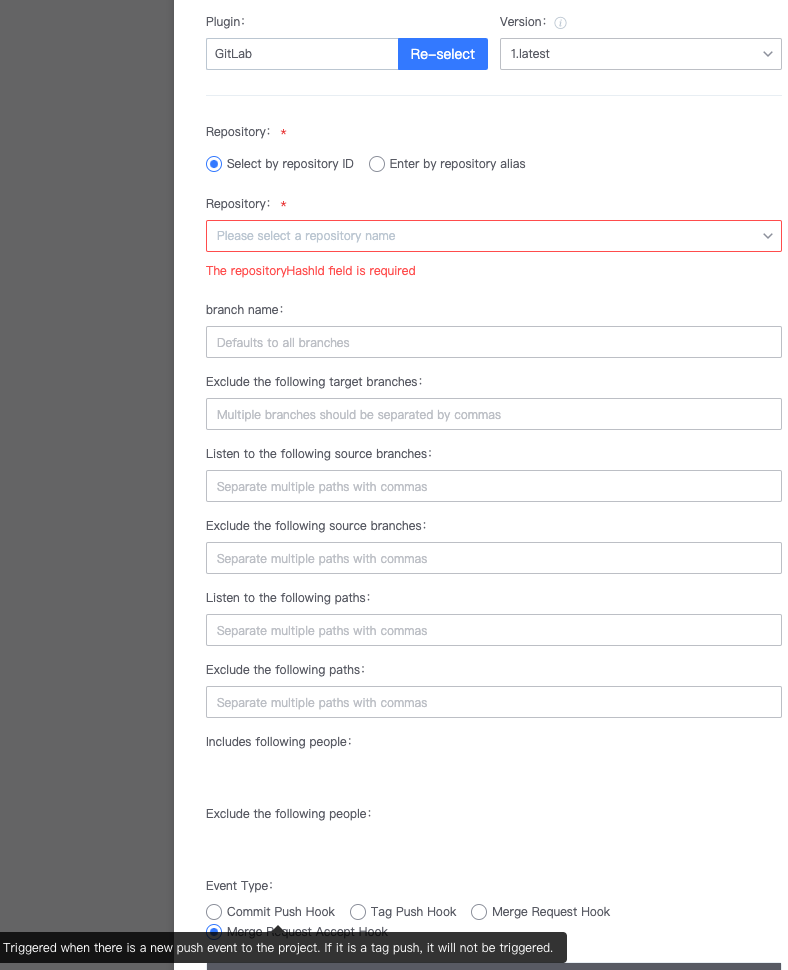
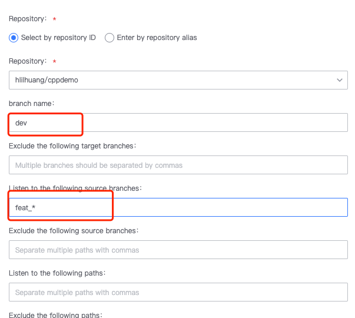
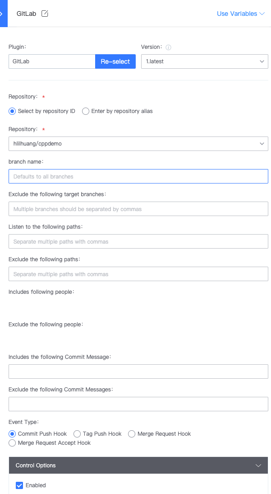

 ## Q1: Merge-Request-Accept-Hook 

  

 The Merge Request Accept Hook is triggered when the source Branch **Success merges into the target branch** 

 For example, if you need to merge feat\_1 into the dev Branch, write dev for the branch and feat\_1 for the listening source branch (you can also use the fuzzy match function with\*, such as feat\_\*) 

  

 ## Q2: Where to setting webhook address for gitlab Triggers 

 You do No Need to setting this hook. BK-CI will register the webhook by itself. After select the Event type and save, the webhook will be registered auto. 

  

 ## Q3: A Pipeline is triggered approve gitlab submit, but view codeRecords is empty.  This Description that the build is still triggered despite no new Code changes 

 The possible reason is that the Triggers listens to the commit event of the entire Code Repository, but the code Pull Plugin only pulls the code of One specific Branch, and there is no code change in this branch. For example, the plugin listens to the commit event of the entire code base, but the code pulling plugin only pulls the code of the master branch, and submit is the dev branch. The codeRecords Display the change of the last check of the pulled branch intersection. The master branch has no change, so there is no change record. 

 ## Q4: How to setting Pipeline to be triggered when PR is raised 

 If you are using gitlab managed Code, setting the gitlab Triggers directly. The types of events triggered are: 

 1. Commit Push Hook Triggered when Code is submit. Tag Push Hook Triggered when Code with tag is submitted 3. Merge Request Hook Triggers when there is a Code merge 4. Merge Request Accept Hook Triggered when Code is merged 

 ## Q5: Is there a Priority for monitoring and exclusion? 

 Monitor> Exclude 

 Assuming that the trigger setting both listening and excluding options configured, and that the event contains both listening and excluding, The Pipeline will fire. 

 ## Q6: Can the listening path be wildcarded? 

 Wildcard functionality is not supported.  Prefix match is currently supported. 

 for example Fill In source in the listening directory and the sourceabc directory is changed, The event will also be heard. 

 ## Q7: The listening path is setting, but the trigger Generate is the listening root directory 

 Meets The expected.  The service is listening to the root directory, but BK-CI will filter according to this path 

 This Triggers is for the BK-CI, and the BK-CI will also filter according to the setting listening path to determine whether to trigger Pipeline. 

 If you only want to limit to a certain path, you need to manual change it. 