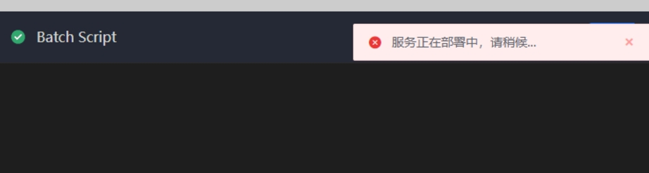

 ## Q1：bkiam v3 failed 

  

 This Error is usually caused by the Not Started the accessCenter SaaS after the machine is restart.  Need to manual pull up SaaS 

 The central console execute ``` /data/install/bkcli start saas-o``` 

 For the Operation required to restart Other machines, please view [Machine Restart](https://bk.tencent.com/docs/document/6.0/127/7582) 


 ## Q2: An error is reported when you click Plugin: Please wait while the service is being deployed 

  

 This is usually caused by the MongoDB abnormal. 

 The central console execute ``` /data/install/bkcli restart mongod``` 

 Then check whether the mongodb status is normal ``` /data/install/bkcli status mongod``` 


 ## Q3: Navigation bar view Display abnormal 

  

 It should be that when the project Start Up, these data have not been written to Redis, resulting in Pipeline not being able to read. 

 This can be done approve restart project service. 

 systemctl restart bkci-project.service 


 ## Q4: BK-CICI machine occupies too much space 

 You can check what file are taking up space. 

 Generally speaking, the build product takes up more space. You can use the BlueKing Job System to clean the build product regularly. 


 ## Q5: The bandwidth between BK-CI and BlueKing MySQL is very large 

 After view, it is mainly the BK-CI-misc.service process that sends and receives traffic. 

 This was a Cron for BK-CI. They would scan and clean up every 12 Second.  The reason for the high traffic is mainly the logic of running data cleaning. 

 If the bandwidth consumption is too large, you can reduce the number of cleaning threads approve build.data.clear.maxThreadHandleProjectNum setting decreased the number of mysql operations. 