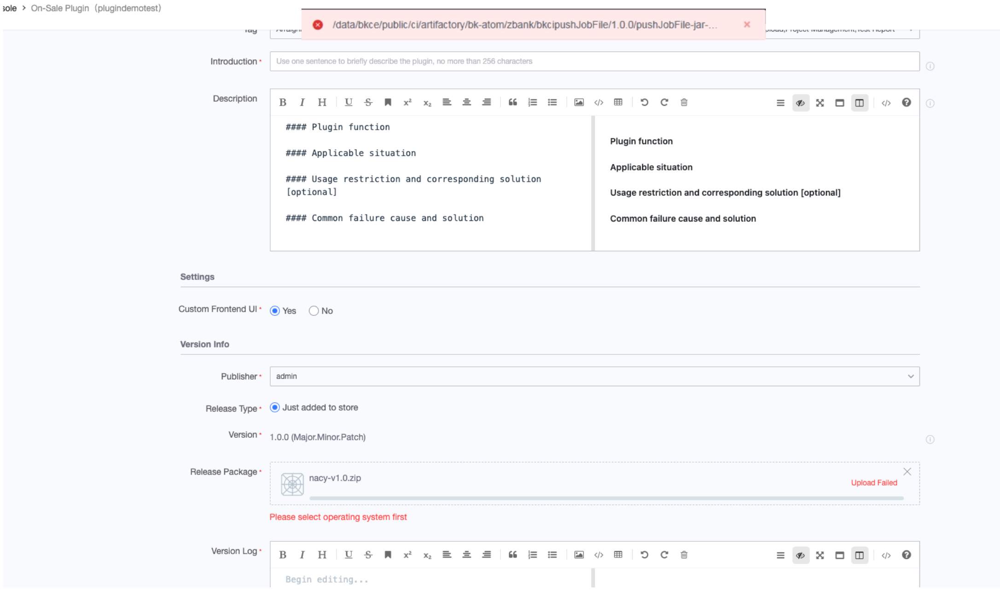
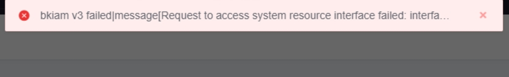
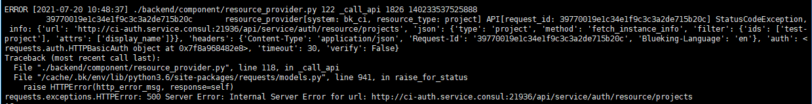
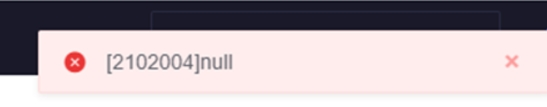

 ## Q1：bkiam v3 failed 

  

 This Error is usually caused by the Not Started the accessCenter SaaS after the machine is restart.  Need to manual pull up SaaS 

 The central console execute ``` /data/install/bkcli start saas-o``` 

 For the Operation required to restart Other machines, please view [Machine Restart](https://bk.tencent.com/docs/document/6.0/127/7582) 


 ## Q2: An error is reported when you click Plugin: Please wait while the service is being deployed 

  

 This is usually caused by the MongoDB abnormal. 

 The central console execute ``` /data/install/bkcli restart mongod``` 

 Then check whether the mongodb status is normal ``` /data/install/bkcli status mongod``` 


 ## Q3: failed to upload Plugin package (store) 

  

 You can first check whether the blueking user can read and write the artifactory Data directory normal: /data/bkce/public/ci/artifactory/ 

 Then check the artifactory log file to see the error. 


 ## Q4: BK-CI reported an error when append node bkiam v3 failed (Pools)(agent) 

  

 And then I checked the log against the The document 

 /data/bkce/ci/environment/logs/environment-devops.log 

 /data/bkce/ci/environment/logs/auth-devops.log 

  

 Troubleshooting found that the T\_AUTH\_IAM\_CALLBACK table under ci Auth library is empty 

 the reason is that that initial setting of the cluster failed, but the Script did not terminate 

 ```ci initialization 
reg ci-auth callback.
[1] 19:29:00 [SUCCESS] 172.16.1.49
{
  "timestamp" : 1626291190535,
  "status" : 500,
  "error" : "Internal Server Error",
  "message" : "",
  "path" : "/api/op/auth/iam/callback/"
}Stderr: * About to connect() to localhost port 21936 (#0)
Solution: Try to manual register the callback of ci-auth. 
source /data/install/load_env.sh
iam_callback="support-files/ms-init/auth/iam-callback-resource-registere.conf"
./pcmd.sh -H "$BK_CI_AUTH_IP0" curl -vsX POST "http://localhost:$BK_CI_AUTH_API_PORT/api/op/auth/iam/callback/" -H "Content-Type:application/json" -d @${BK_PKG_SRC_PATH:-/data/src}/ci/support-files/ms-init/auth/iam-callback-resource-registere.conf
```


## Q5: JOOQ;uncategorized SQLException for SQL (Store)(Plugin) 


 The old SQL was not cleaned. 

 ``` 
 # Clean up the flag file and import All sql files 
for sql_flag in $HOME/.migrate/*_ci_*.sql; do
chattr -i "$sql_flag" && rm "$sql_flag"
done
 # import Database SQL only execute the central console 
cd ${CTRL_DIR:-/data/install}
./bin/sql_migrate.sh -n mysql-ci /data/src/ci/support-files/sql/*.sql
```


## Q6：pipeline start failed  parallel upper bound 


 A single Pipeline running more than 50 Task concurrently will affect performance and may failed.  So Limit. 


 You can Revise Database Limit 
update devops_process.T_PIPELINE_SETTING set MAX_CON_RUNNING_QUEUE_SIZE=100 where PIPELINE_ID='${pipeline_id}'; 
 It is recommended that the maximum should not exceed 100 

---

 ## Q7: Error 2102004 when using Pipeline file var 



 When upload, you need Fill In the full path of the variable including the fileName.  The functionality dependOn BK-CI BK-Repo. 