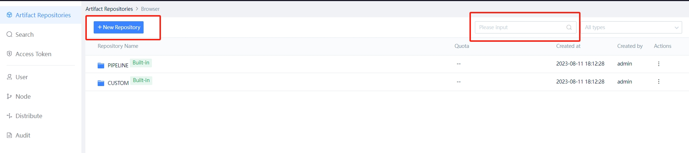

 # Archive and Pull of Artifact 

 The continuous integration platform provided a BK-Repo that allows you to Archive and Share products such as ipa, apk, maven, docker image, and Two packages. Combined with Pipeline, it will make continuous delivery easier. 

 ## Home of BK-Repo 

  

 The continuous integration platform create two repositories by default: 
 - pipelineRepo: The Artifact path is related to the buildNo of each execute of the pipeline, and the products executed multiple times will not Overwrite each other 
 - customRepo: Artifact path is defined by user. Duplicate paths will Overwrite each other. 

 In the same Pipeline, file can be Shared across jobs approve the BK-Repo (Archive under the Job that Generate the artifactory, and download to the local agent under the Job that uses the component). 

 ## Add a Warehouse 

 You can create a customRepo approve the `add Warehouse` entry. 

 Next you may need 

 * [Archive](archive.md) 
 * [download Artifact](download.md) 