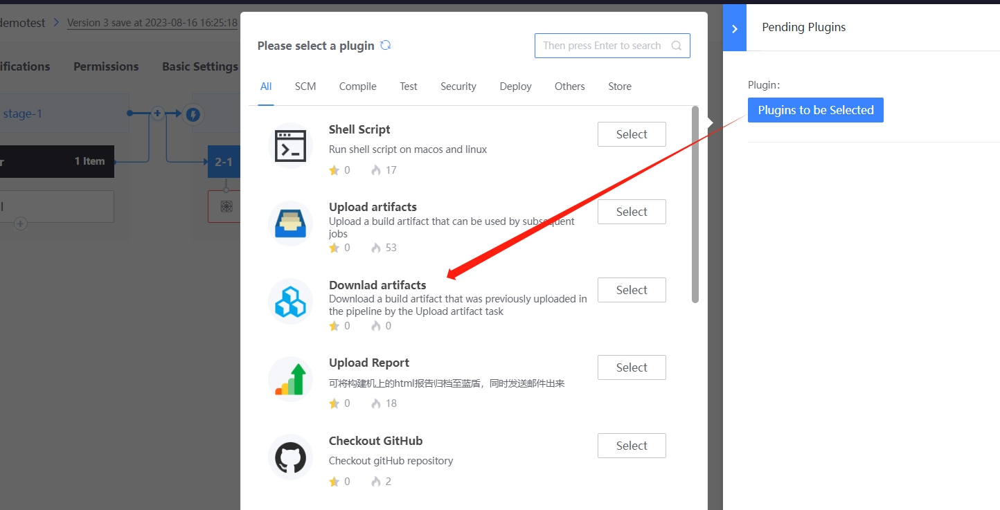
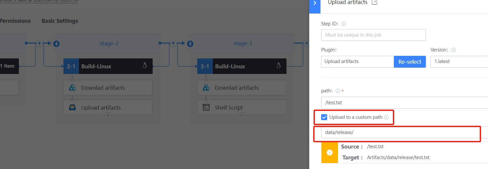
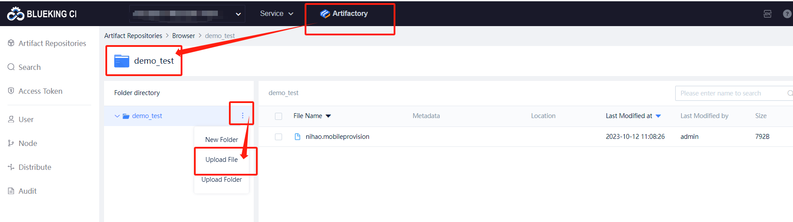

 # Archive Artifact 

 ## Archive Artifact in Pipeline 

 After compiling the output artifactory, append the `Upload artifacts` Plugin Archive the component to the BK-Repo 

  

 ## Setting the path of the product and Archive it to pipelineRepo 

  

 If `Upload to a custom path` is not checked, the artifactory will be Archive to `pipelineRepo`. The path format in the BK-Repo is: 
 ``` 
 /<pipelineName>/<BK_CI_BUILD_NUM>/<artifactName>
 ``` 
 Note: The path in the above figure is the relative path of artifactory in the local workspace of the agent. After Archive to pipelineRepo, there is no directory structure. 

 For example, path: a/test.apk, the Archive path is: /Demo/1/test.apk, the path does not include the a directory. 

 execute Pipeline, check whether the component is Archive approve Plugin log and partView 

 ## Setting the path of the product and Archive it to customRepo 

  

 When `Upload to a custom path` is checked, the artifactory will be Archive to `customRepo`. The path format in the BK-Repo after archiving is: 
 ``` 
 /target path Set in Archive Plugin <artifactName>
 ``` 

 execute Pipeline, check whether the component is Archive approve Plugin log and partView 

 ## Manual upload Products in BK-Repo 

 Under the BK-Repo service, Enter One warehouse, New Folder or upload the product directly 

  

 Next you may need 

 * [BK-Repo](Artifactory.md) 
 * [download Artifact](download.md) 