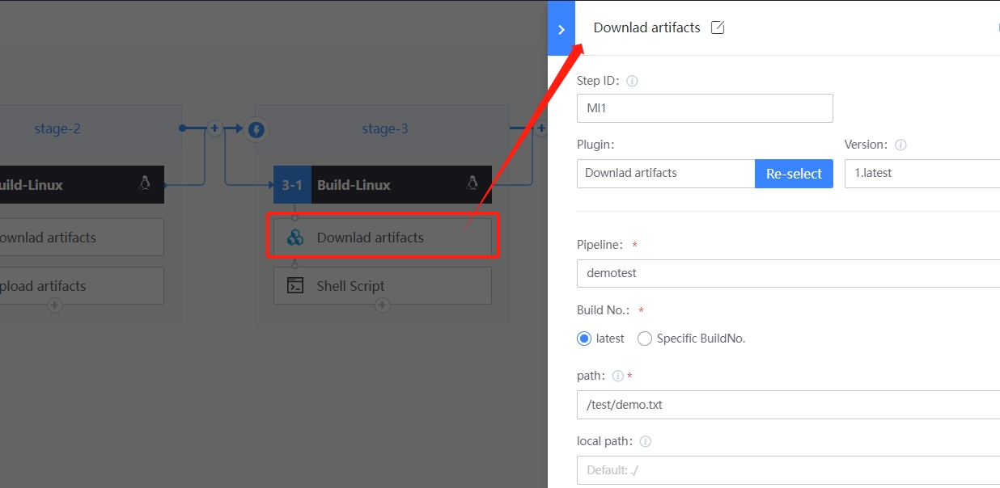

 # Download Artifact 

 ## Automatic download during pipeline run 

 After the artifacts are archived in the BK repo, a new buildEnvType `Job 3-1` can be appended downstream. 

  

 Append and set the `Download artifacts` plugin to pull the artifactory upload to the BK repo. 

  

 run pipeline and check if the artifactory is pull success approve plugin log 

 ## Download the manual into the pipeline 

 Open pipeline pipelinesDetail, partView tab and download manual for archive components 

  

 ## Manual download from BK-Repo 

 Enter the warehouse corresponding to the BK-Repo, and find the artifactory you want to download. 

  

 Next you might need 

 * [BK-Repo](Artifactory.md) 
 * [Archive](archive.md) 