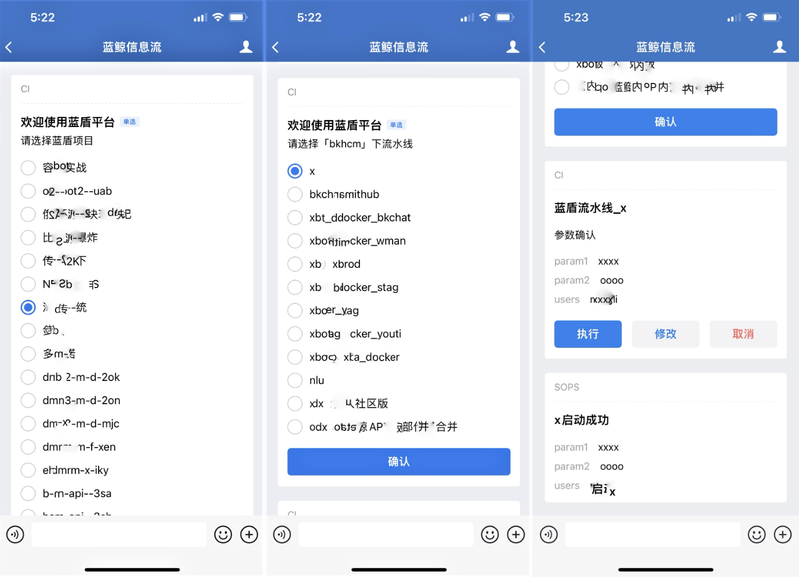

 # How to use bkchat? 

 BkCHAT has two versions 

 1. Skills-free create mode, ie, no authentication version, users can run all BK-CI pipeline in WeCom 

 2. customize skill mode, user set custom operation instructions and perform auth on the page to limit the pipeline runs permissions of specific users. 

 ## Skill-free creation mode 
 1. Open Configured Apply number directly, enter "1" or "help", and click the top right corner of the message to pop up the corresponding operation to bind the company name. 

  

 2. To execute BK-CICI, click "CI" to pop up select "BK-CI project". After selection, continue to select "pipeline" of BK-CI to the final execution. 

  

 3. Standard OPS execution, supporting the selection of "group" mode. 

  

 4, we also support the task search function, as follows, you can freely enter the task you want to execute, the background will match you to the best task. 

  

 5. Voice interaction example 

  

 ## Customize Skill Mode 
 1. set skills (BlueKing page opens bk-chatbot Apply) 

  

  

 We can specify regular match for parameter, and bkchat dialog will extract parameters for regular match. 

  

  

 2. Trigger the task 

 Find the robot "bottom message notification" on WeCom (Enterprise WeChat setting) and chat with it privately. 

  

 Then enter the task parameters one by one according to the prompts, and the startup will be automatically triggered and started after the input is complete. At the same time, BKChat also supports entering skills and parameters together, so the robot will extract parameters to start according to the previously set rules. 

  