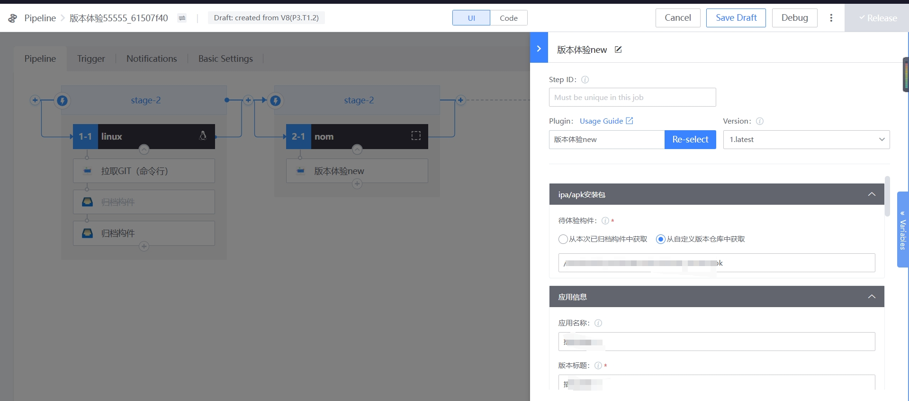

 # Mobile Experience Guide 

 ## Experience Access ** 
 ### ** BK-CI Pipeline Setup ** 
  

 #### ** Setting ipa/apk install package **. 
 Path to the install package to upload: 
 - Select the install package to upload from the path of this build. 
 - Supports ipa file, apk files and compressed package. 

 #### ** Setting Application Information 
 - Name of the application: 
    - The name of the application that will be displayed on the experience.  If the configItem is empty, the plugin will automatically get the application name built in the ipa/apk package. 
 - Version number: 
    - The version number to display on the experience.  If The configItem is empty, the plugin automatically gets the versionNum built into the ipa/apk package. 
 - Apply Description: 
    - A detailed description of the experience version.  It can be completely customized by the business name party.  Starred description include: a summary of the application; version of the changelog and so on. 
 - Product maintainer: 
    - You can pull address book from WeCom and select multiple addresses. 

 #### ** Setting Experience Range ** 
 - Experience end date: 
    - End date: After this date, the experience will automatically expire and can no longer be downloaded. 
    - Select Relative Time or Absolute Time 
        - Relative Time: The current pipeline build time plus the relative time, in days, is the end date of the experience. 
        - Absolute time: The date you select is the end date of the experience. 
 - Experienced personnel: 
    - Supports the selection of individual employees. 
    - Supports selecting Experiencers by role. 

 #### ** Setting noticeType **. 

 - NoticeType: 
    - After complete experience is released, send a notification to approve the application number. 
    - The notification staff supports the application service personnel or experience personnel. 

 ### ** Experience the use of the application by version ** 
 Select the "Experience" Apply from the WeCom Workbench. 

  

 Select the Apply you want to experience, click "download" to quickly download the application, ipa will prompt location Safari to download. 

  
 

 Click the Apply title to enter the deployment details, and the application principal can manage the application: 
   - The product principal has the authority to revise the personal information and experience expiration date. 
   - Experiencers can only view and download the application. 

 After the expireDate is reached, the Experience Personnel will not be able to view the application from the Experience Home, the Product Principal will still be able to view the application, and the application will have an "expired" TAG. 

(If there are multiple version(s) of the application, you can download the Approve HistoricGuide) 

 

After checking "Notification", the Experience Plugin will send rtxNotice message to the auth personnel after the Apply fileUploadSuccess. click "Go Immediately Go to to quickly access the" Version Experience "application. 

