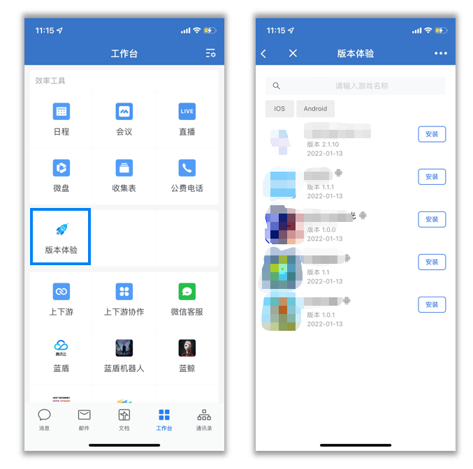
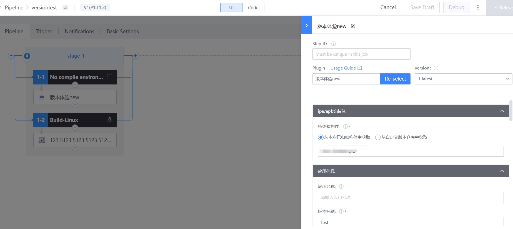

 # ** Introduction to Mobile experience ** 
 experience service can Release the ipa/apk package build by the Pipeline to the version experience Apply on WeCom, so that the product, Test team and Other members in the company can assist your Business Name verify the new features of the product, discover the potential defects of the product, and let your product get a closed loop in the internal verification Flow. 

 ## ** Features of Mobile experience * 
 - Integrate with WeCom Apply, and inherit enterprise WeChat authentication, making it more convenient and Safety to use 
 - provided BK-CI Plugin, and build Pipeline integration 
 - Support ipa and apk download and install 
 - Support HistoricGuide download 
 - downloadLink dynamic Generate, and Access Management can be performed according to the link Expire Time 
 - file storage supports Tencent Cloud COS 
 - Support experience personnel and time Manage, experience personnel from the WeCom address book synchronization 
 - Support for New version notification 
 - Back-office service support scale-out 

 ## ** Technical architecture ** 
  

 ##  Apply Manage  
 - You can quickly experience and Manage Apply approve the "Workbench"(experience) of WeChat at Work. 

  

  

 ## ** Apply download ** 
 - click "download", you can quickly download the Apply, ipa will prompt location safari to download, The downloadLink is dynamic Generate, you can setting the number of downloads or Expire Time to Manage access Limit 

  

 ## ** Pipeline Plugin * 
 - "experience Plugin" is integrated with the compilation build Pipeline, and provided experience auth Manage, New version notification and other functions 

  

 ## ** version Notification ** 
 - After the experience Plugin checks "Notification", it sends rtxNotice message to the auth personnel after the Apply fileUploadSuccess 

  

 ## ** Deploy Cost ** 
 - [hardware resources required to Deploy mobile experience](client-experience-cost.md) 