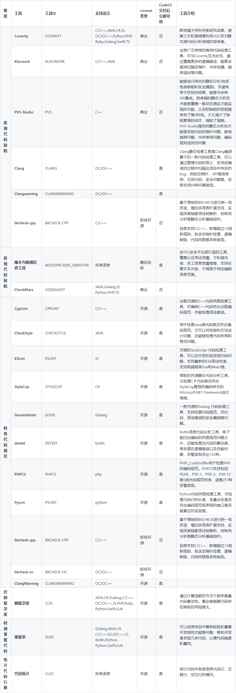

 # Introduction to Blueking Code Check Center 
 Code Analysis, also known as static CodeCC, refers to the correctness of the program approve analyzing or checking the syntax, structure, process, interface, etc. of the source program without Run the tested code, and finding out the hidden Error and defects of the code, such as Memory leakage, null pointer reference, dead code, var uninitialized, copy paste error, duplicate code, high Function complexity, etc. 

 Blueking Code Check Center (Code Analysis Center) provided professional code inspection solutions to check defects, vulnerabilities, specifications and other Dimension to ensure product quality. 

 # Problems Blueking Code Check Center can solve and toolsets supported by default after delivery 
  

 # ** Features of Blueking Code Check Center ** 
 **Five inspection Dimension are supported:** 

 At present, it has integrated more than ten code inspection tools including commercial, open source and Tencent's self-developed code inspection tools, Overwrite Code Defects, Security Vulnerabilities, coding specifications, Cyclomatic Complexity and code Duplications. 

 **Rich platform features:** 

 approve fast and accurate analysis of source Code, find out quality problems and Security Vulnerabilities, and provided self-service access, Real time scanning, Alert display, Silences, regular daily report, repair incentives and other functions. 

 **Gate (planned to open to the public in mid-2022):** 

 It is deeply integrated with the BK-CI Pipeline. approve the Gate service, Blueking Code Check Center inspection result can be used in the pipeline to control the Code Repository MR/PR, transfer test, Deploy and other Flow, so that the pipeline output at each Stage Meets The quality standard. 

 **Self-service tools (planned to open in the second half Year 2022):** 

 Support tool App framework and rule development framework, Overwrite eight Starred Language. 

 # ** How to Start Up the next ** 
 **If you want to try it first:** 

 Our experience environment can meet your needs for functional Test, please feel free to contact your docking person.  He will provided you with information such as the experience environment Account and signIn method. 

 **If you want to Deploy directly:** 

 Blueking Code Check Center Deploy requires additional [hardware resources](../../services/codecc/codecc-cost.md)。  Once the resources are ready, we will Start Up Blueking Code Check Center landing Immediately. 

 # **FAQ** 
 **Q: Can I use Coverity's abilities?** 

 A: Coverity requires you to purchase your own License.  After the purchase is complete, you can directly call Coverity approve the Blueking Code Check Center Plugin to scan your Code.  Other commercial Code scanning tools are similar. 

 **Q: Can I use tools that I use but are not included in the existing toolset to access Blueking Code Check Center?** 

 A: We will provided a "customize listing tool" to meet The demand in the second half Year 2022. 

 **Q: Can I customize the Checkersets covered by the tool to meet my needs?** 

 A: We will provided a "customize listing tool" to meet The demand in the second half Year 2022. 

 # ** Appendix: Detailed description of each tool ** 
  