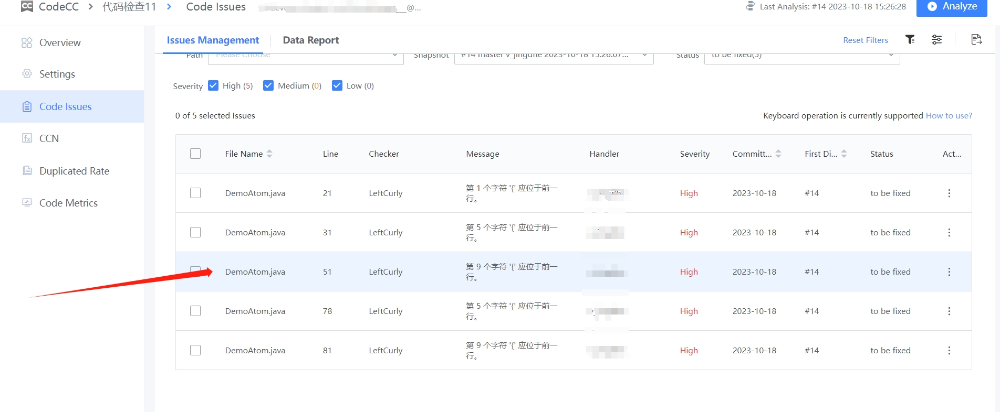
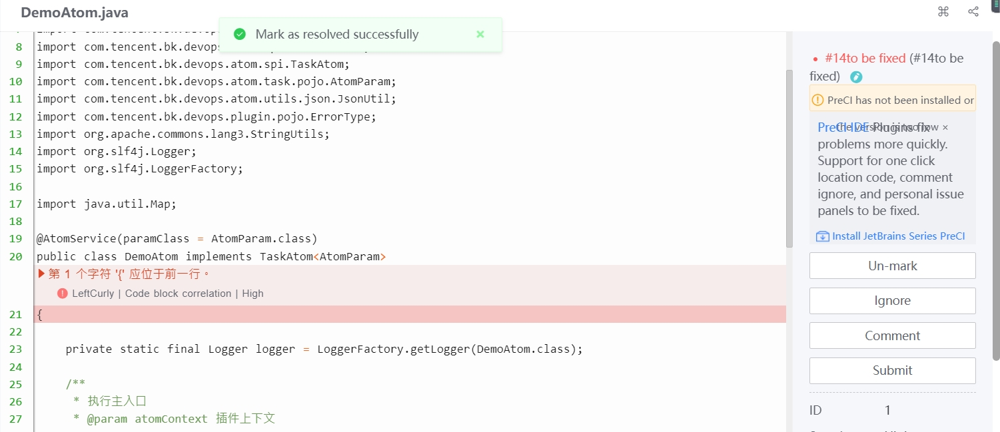
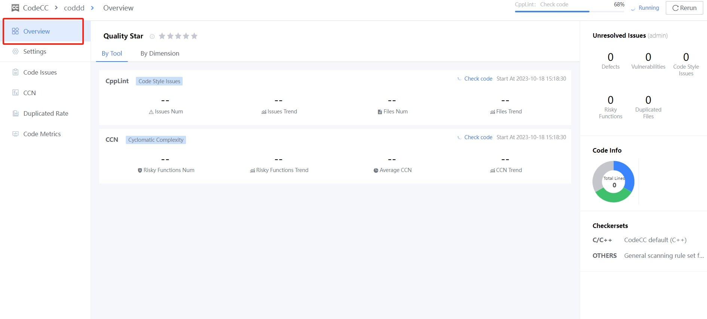

 # Code Analysis Result 

 Click the Pipeline Code Analysis result number to go to the Blueking Code Check Center detail page, which will display the specific code problem and the severity of the problem. Click "Location" to find the specific location of the code problem 

  

 Click "Problem Location" to quickly locate the specific location of the code problem. Develop a manual fix for the code problem. If the problem has been fixed and is ready for a next commit, click Mark. If the problem is still found on the next check, it will be highlighted. 

  

  

 If the rule does not match the developer's own design, or does not match the developer's own code style, it is considered that there is no need to worry about scanning the problem, and you can select "Ignore the problem"; if the problem is ignored, it will not appear in the list to be fixed. 

  

  

 The "Data Report" function of Code Problem can observe the changed trend of multiple code analysis result 

  

 The overview shows the statistical result of this code analysis 

  