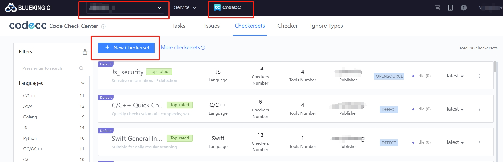
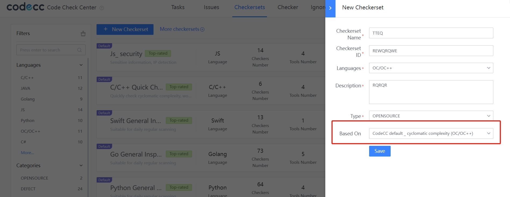
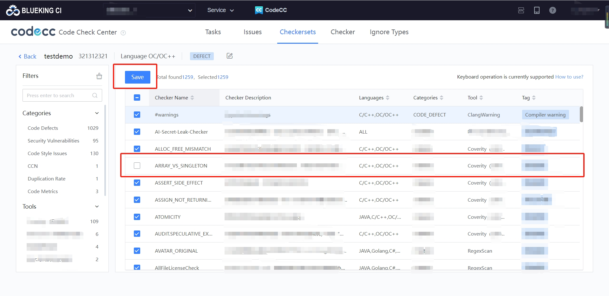

 # Code Analysis Checkersets 

 ## Customize Checkersets 

 The number of rules in the default ruleset is relatively small, which does not meet the user's needs, or some rules in the ruleset do not match the company's or developer's code style. In this case, you can create a custom ruleset. 

 > scene simulation: The "build/include\_what\_you\_use" rule in BlueKing Code Check Center's default (C++) rule set does not match the company's code development style. I hope to remove this rule. 

 ### Creating a Checkerset 

 Customize checkersets are project. You must select the target project before creating a custom rule set. 

  

 Select Blueking Code Check Center default (C++) for "Based on" and Customize Checkersets can be added or deleted to the default rule set. 

  

 ### Add/Delete Rules 

 A customize checkersets based on CodeCC default (C++), which contains all rule entries of CodeCC default (C++) by default. user can navigate to the No Need rule "build/include\_what\_you\_use" and cancel it to save the rule set. 

  

 ### Select a custom checker set for the pipeline 

 Override the default checkersets in the pipeline, select the customize rule set, and save the pipeline again. 

  