 # Code Analysis using 

**Blueking Code Check Center access step:**

 1. setting the Code Repository as a target for code scans 
 2. createPipeline and Pull target Code 
 3. setting Blueking Code Check Center Plugin 
 4. execute Pipeline 
 5. view Code Analysis result 

 ##Blueking Code Check Center 

 ###setting Code Repository 

 Select a project-service-Code Repository 

 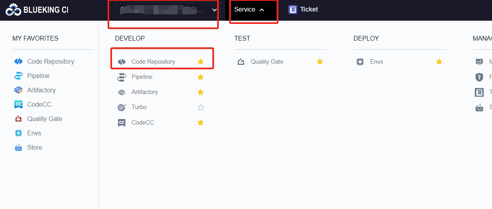 

 "linkCodelib"-"gitlab code base" Here is the gitlab code base as an example 

 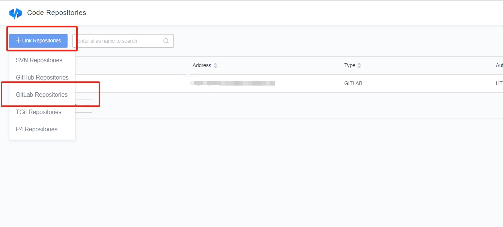 

**For the use of Other type of Code Repository, please refer to:**[Code Repository](../repo.md) 

**There are several conditions for link gitlab Code Repository:**

 1. Use accessToken to link 
 2. The all of create accessToken must be the maintainer Role of the target repository 
 3. accessToken requires at least api auth 
 4. The codelibUrl is the http/https protocol 

 AccessToken uses "credentialManage" to register. If accesstoken has been registered in "Certificate Management" and linkCodelib, you can directly select the corresponding accesstoken 

 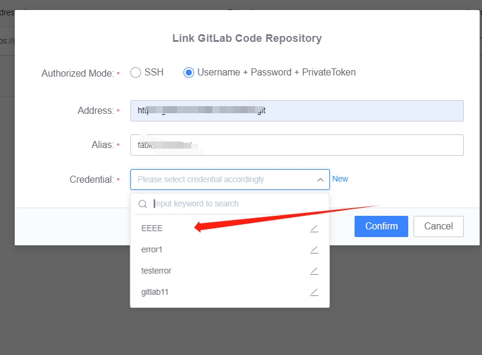 

 If you register an accessToken in credentialManage, you can new a certificate and location to the Certificate Management page 

  

  

 For the creation of gitlab accessToken, please refer to: [Create accessToken](https://docs.gitlab.com/ee/user/profile/personal\_access\_tokens.html) 

 Then go back to the linkCodelib page, select the accessToken you just create, and determine 

 .png>) 

**For Other type of vouchers, please see:**[credentialManage](../  ticket.md) 

 ### CreatePipeline 

 Select a project-Service-Pipeline-addPipeline-projectCustom-Fill In pipelineName-New 

  

  

 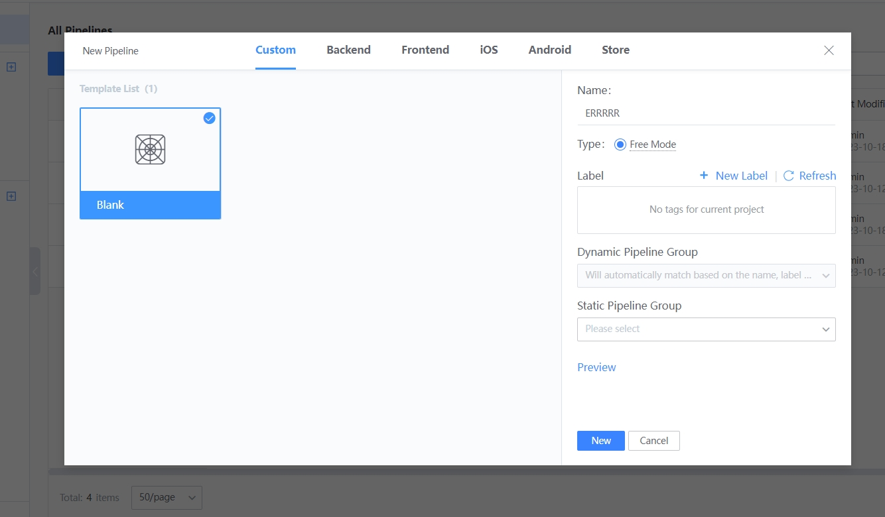 

 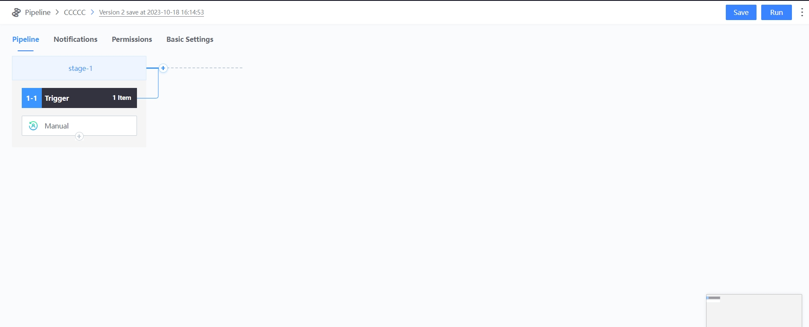 

 After the Pipeline is add, you need to append a Plugin for Code Pull and a plug-in for Code Analysis. For code checking, you need to pull the code to the workspace where the buildEnvType is located. For pulling the code, you need to select the checkout gitlab plug-in. 

 "append stage"-"select linux agent"-"addAtom"-"Select checkout gitlab plugin" 

 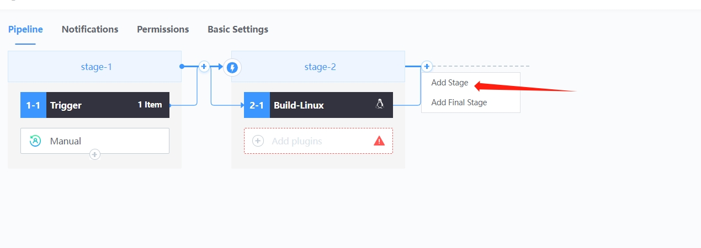 

  

  

 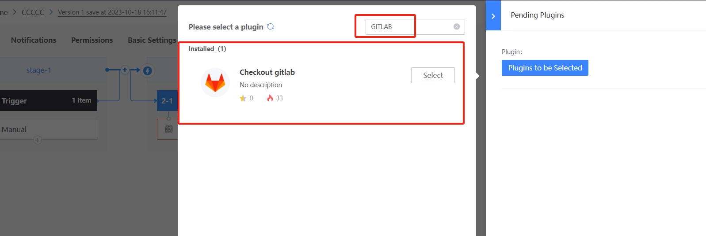 

 Setting checkout gitlab Plugin and select the Code Repository create for the previous step 

  

 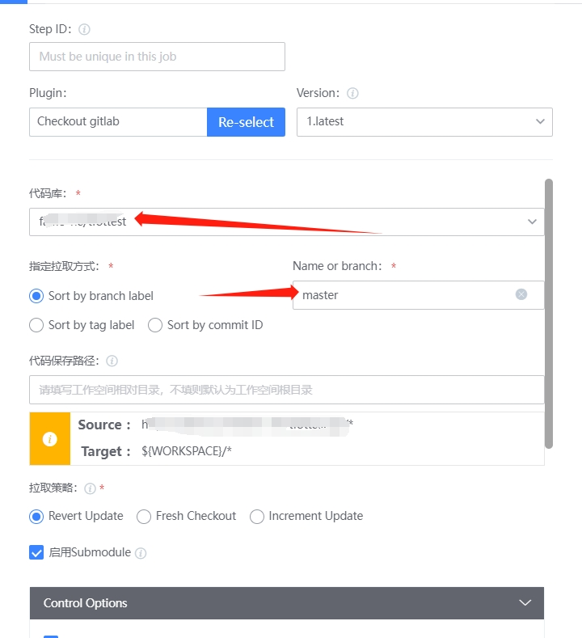 

 ### Checking setting Code 

 Append Code Analysis Plugin 

 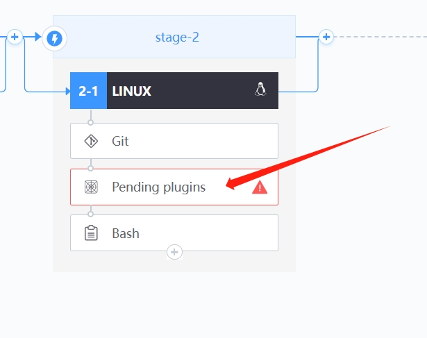 

 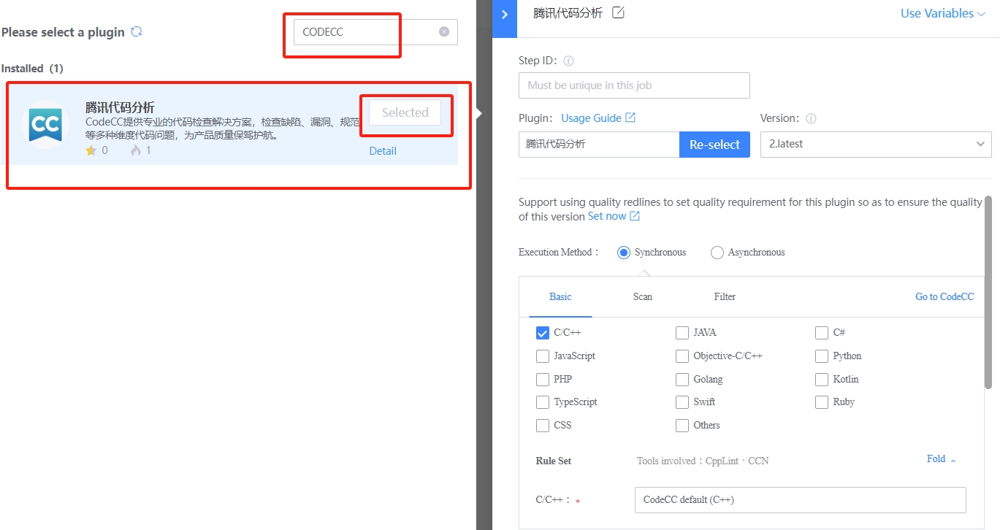 

 Setting Code Analysis and select synchronization method. In baseSetting, select the corresponding engineering language according to the Code Repository language and the corresponding Checkersets. The rule set is the standard followed by Blueking Code Check Center for code scanning. Codecc will provided the default rule set. If the rule set does not meet the requirements, you can customize the rule set.  customize Checkersets please refer to: [Code Analysis Rules](codecc-ruleset.md)"Scan setting" select Increment scanning,"path Shield" can Set path whiteList, once set, code check will only scan file under whitelist path; setting a path blacklist, the Code Analysis Plugin will not scan file under The path. 

 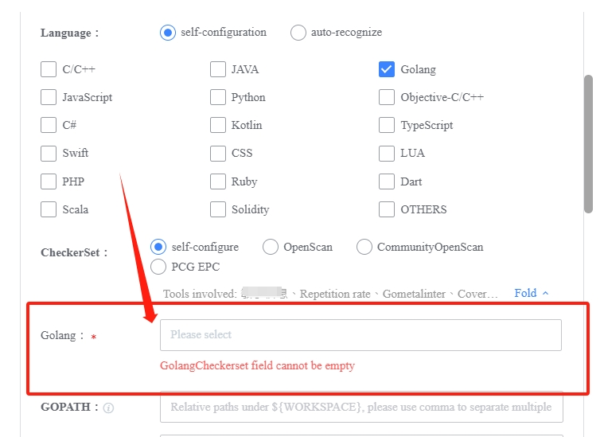 

 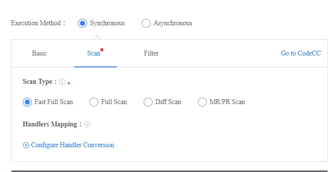 

 Wildcards are supported for paths. If the path is complete, it must start with/. If the file to be Shield is repo-name/initial/src/main/java/hello/HelloWorld.java, the whiteList of paths is/initial/src/main/java/hello/HelloWorld.java. 

  

  

 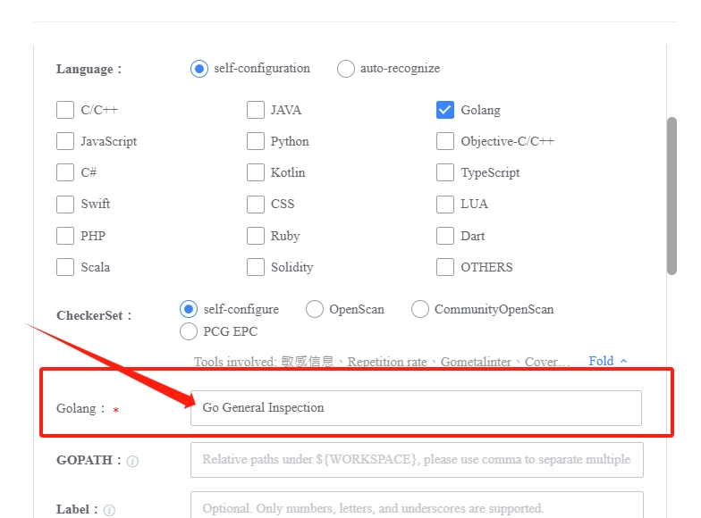 

**For Other Code Analysis Plugin Config, please see:**[Code Analysis setting](codecc-config.md) 

 ### Execute Pipeline 

 Overall view of the Pipeline: 

 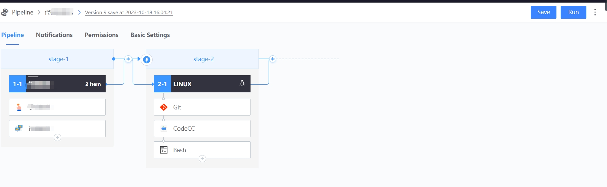 

 SaveAndExec Pipeline: 

 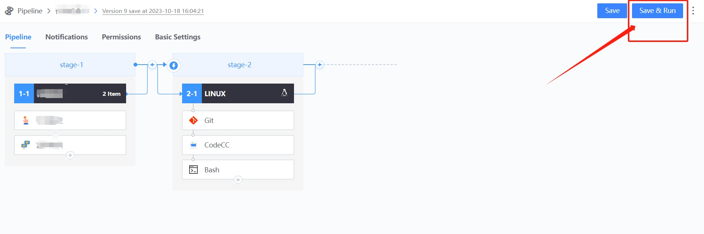 

 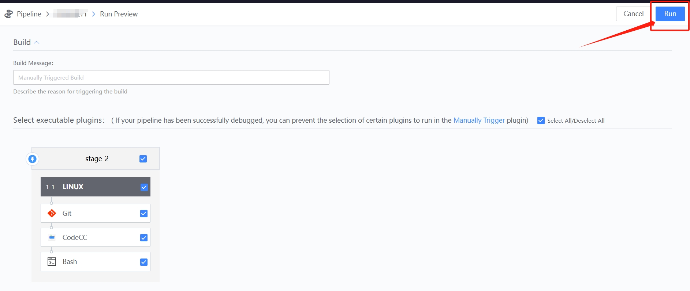 

 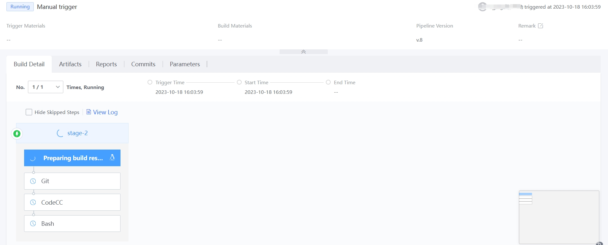 

 ### view Code Analysis result 

 "Waiting for execution to complete"-"click Code Analysis Plugin"-"view report" 

 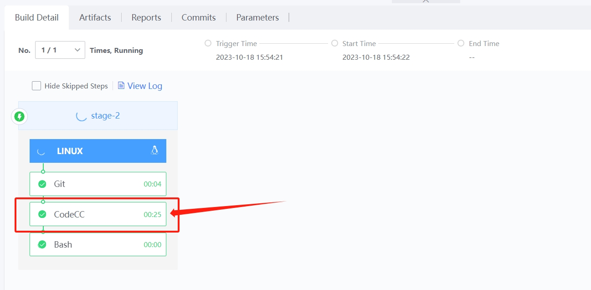 

 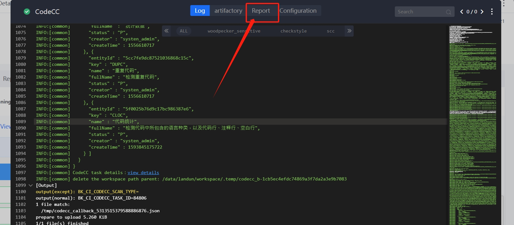 

 click number to location view the specific problem 

  