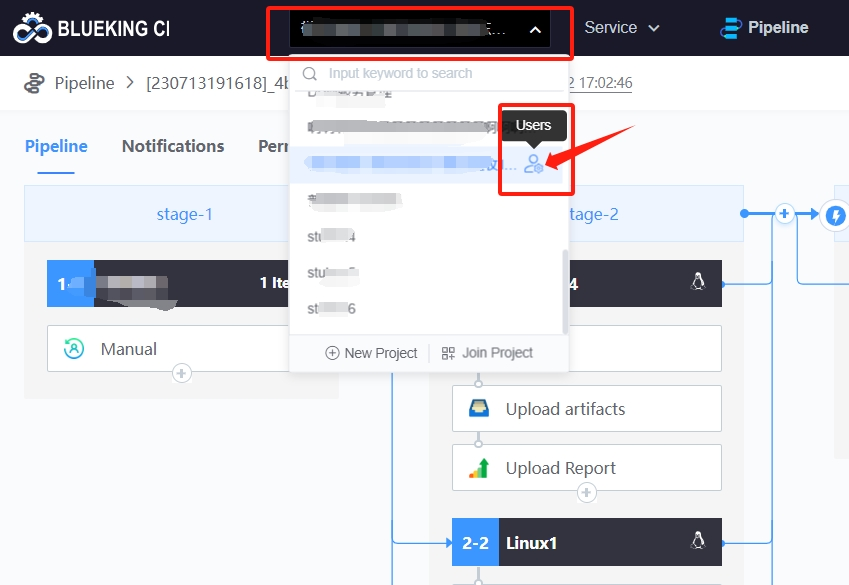

 # Append user to project userGroup 

 Only the ProjectManager can append users to the userGroup at the project level. 

 First enter the project userGroup management interface: 

  

 Find the appropriate userGroup and add the member to the userGroup: 

  