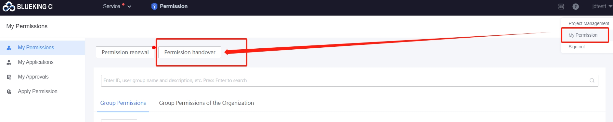
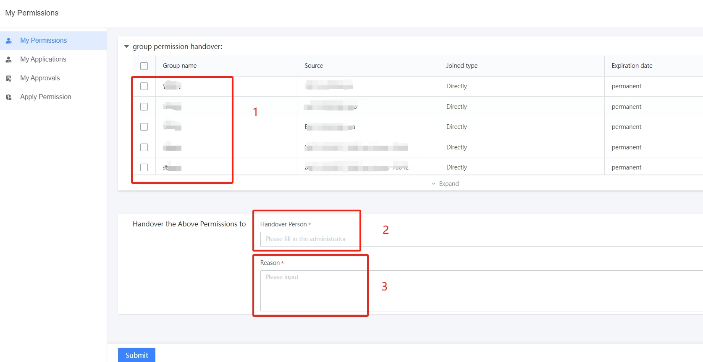

 # Transferring Auth 

 When the scope of work changes or the user leaves the job, the user can transfer their auth to the new principal. 

 The transfer entry looks like this 

  

 Enter the auth transfer page: 

  

 - Select the auth to transfer (userGroup) 
 - Fill in the new principal 
 - Fill in the reason for the transfer 

 Submit to complete the auth transfer 