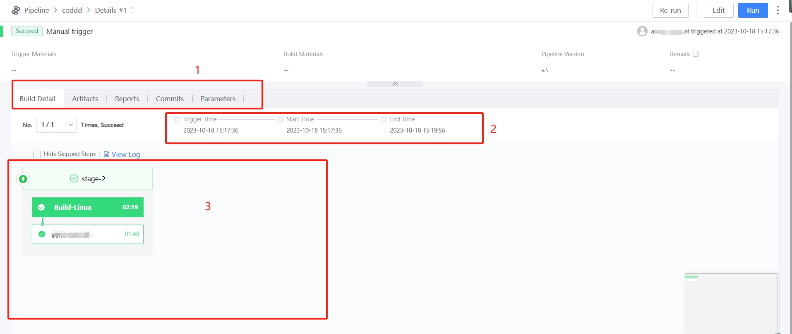

 # Pipeline Details Page 

 ## Introduction to Function Area 

  

 1. name of the detail page: it consists of **4 tabs: pipelinesDetail, partView, codeRecords and outputReport**. 
   - pipelinesDetail: displays the execution result of the pipeline task Approve Visual Orchestration 
   - partView: View the build artifacts for this Task 
   - codeRecords: Display the commit record of what changed in this build compared to the last build 
   - outputReport: If appropriate plugin is appended, auto test report can be displayed 
 2. Task overview area: Display basic information such as task total, executor and totalTime 
 3. pipelinesDetail: Display the totalTime spent on each job and task 

 ## Next you may need 

 * [BK-CI Navigation Bar](../Console.md) 
 * [Pipeline List Page](pipeline-list.md) 
 * [Create/Edit Pipeline](pipeline-edit.md) 
 * [Pipeline Task History](pipeline-history.md) 