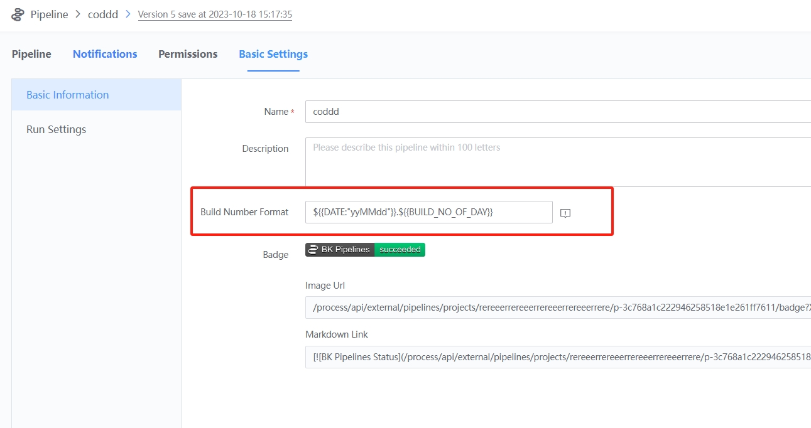

 # Enable customize buildNo for pipeline 

 ## Why do I need to customize buildNo? 

 The default pipeline buildNo is composed of numbers that increase by 1. To increase visibility, we allow you to set aliasName for the pipeline build number. When enabled, your customize buildNumberFormat will be preferentially displayed on the page display. 

 ## Enable method 

 Enter the basic pipeline settings page and set the appropriate buildNo rule, for example 

 ```text 
 ${{DATE:"yyMMdd"}}.$ {{BUILD_NO_OF_DAY}} 
 ``` 

  

 ## Rule Description 

 ## Available formats 

 | KEY | Example | 
 | :--- | :--- | 
 | YEAR | 2020 | 
 | DAY\_OF\_MONTH | 28 | 
 | DAY\_OF\_YEAR | 285 | 
 | HOUR\_OF\_DAY | 23 | 
 | MINUTE | 55 | 
 | MONTH\_OF\_YEAR | 3 | 
 | BUILD\_NO\_OF\_DAY | increment from 1, reset daily| 
 | DATE:"yyMMdd hh:MM" | 20201028 10:08 | 
 | SECOND | 59 | 

 * Corresponding var of the new field: ${BK\_CI\_BUILD\_NUM\_ALIAS} 
 * The maximum length of the character is 256 characters. 
 * The character can generate a real string of up to 256 characters. 
 * A strong warning is required to set a custom buildNo: buildNumRuleWarn 
 * Overlong buildNum will not affect pipeline build 


 ### Allow characters 

 * The characters allowed by the rule will be changed to:   characters, and the length is between 1-256. 
 * The rules for formatting time in the database should be set as follows: DATE:"\(.+?\)"，\(.+?\) It refers to a general rule. user setting rules consisting of upper and lower case letters, spaces,:, -and other characters, such as: yyyy-MM-dd HH:mm:ss 3. user setting rules, refer to specific rules approve $xx 

 ## Effect display 


  