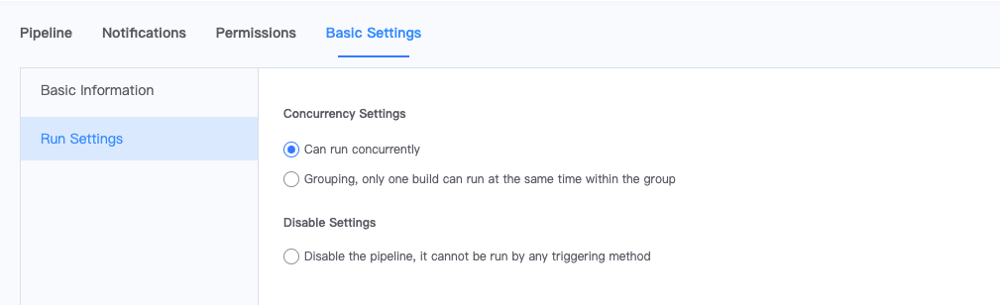

 # DisablePipeline 

 ## What is a disablePipeline? 

 In some scenes it may be necessary to disable the pipeline trigger type for a certain period of time and enable it again at a certain time in the future. This function can be used. 

 ## How to disablePipeline 

 Pipeline in both freedomMode and constraintMode can be set to disable as follows: 

 Enter Pipeline Edit Page-&gt;baseSetting-&gt;runLock 

  

 ## Impact of Disable 

 Once the pipeline is disabled, no triggerType can start the pipeline. 