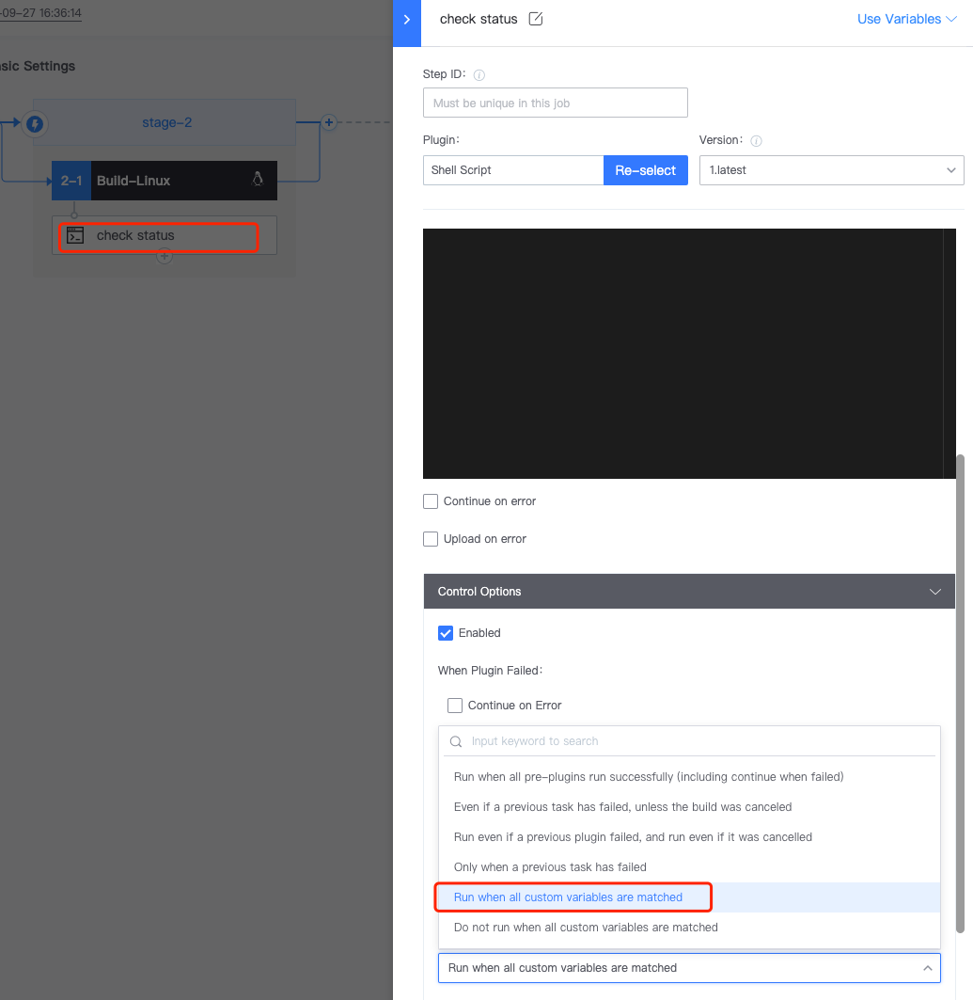
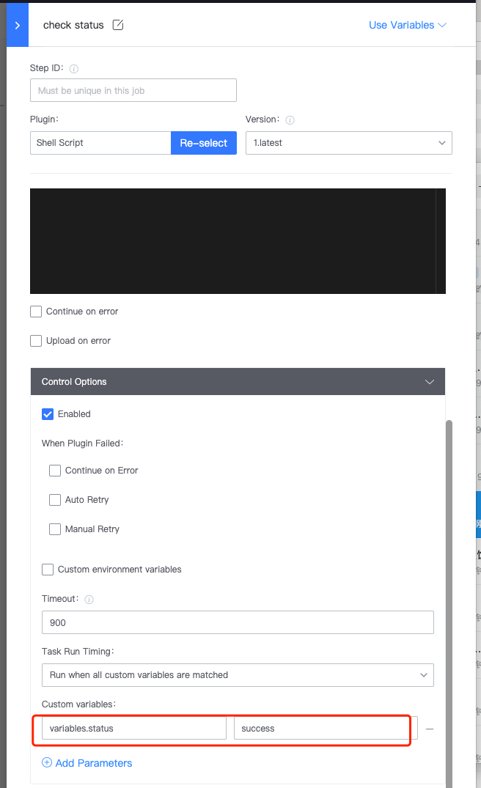
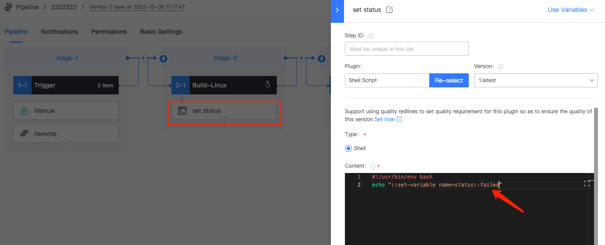
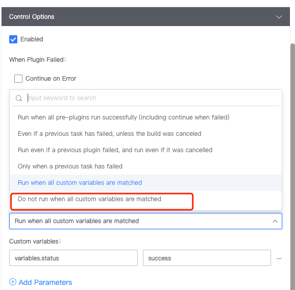

 # Using Variables to Control the Pipeline 

 Users can control the execution of subsequent tasks through custom variables to achieve the purpose of controlling the flow of the running pipeline 

 **Consider a scenario:** If the shell script of step 2 is executed successfully, the shell script of step 3 is executed. 

 1. The stage 2 shell plugin sets the status variable 

     

 2. The stage 3 shell plugin selects "Run only if all custom variables are satisfied". 

     

 3. The new shell plugin run condition variable is `status == success`. 

     

 4. Condition fulfilled, execution successful 

     

 5. Analog variable setting failed 

     

 6. The condition is not met and the plugin is not executed 

     

    Similarly, you can set the plugin execution conditions the other way around: "Run if all custom variables are not satisfied". 

     