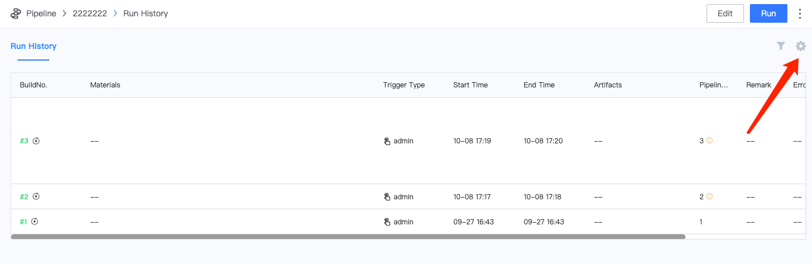
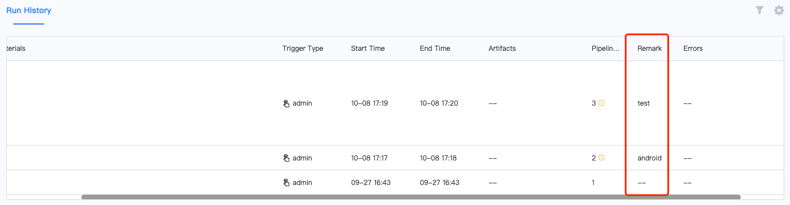

 # Pipeline remark var 

 Pipeline remark var: `BK_CI_BUILD_REMARK`, which uses a short text description to distinguish the contents of each build. For example, set `BK_CI_BUILD_REMARK` to versionNum to indicate the version of the packaged product. Or set to platform (windows/pc/ios/andriod) to indicate the platform of this package. 

 **Applicable scene:** To distinguish the build history of the pipeline 

 1. Set remark var 

     

 2. Show remark var 

     

     

     ! 

 **Note**: Remark var is only displayed when the pipeline is finished. 