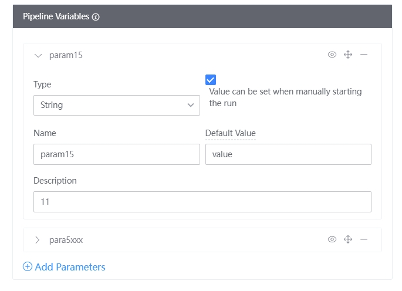

# UseParams in the pipeline 

 You can use [customize pipelineVar](./) in any plugin form variables-custom.md) 
 - Reference system var: `${{ BK_CI_PIPELINE_ID }}` 
 - Reference global variables: `${{variables.  <var_name>}}` 
 - Reference to the output var of the task: `${{jobs.  <job-id>.steps.  <step-id>.outputs.  <output-var-name> }}` 

  

 Reference the global variable fooBarVarName in the path field of the Upload Artifacts plugin, as shown below 

 ## Set the value when manually triggering the pipeline 

 1. If the pipelineVar definition and the "showOnStarting" option is enabled when editing the pipeline, the ** Pipeline pipelinesPreview page ** will be displayed after the pipeline is run; 

  

 2. Enter the pipelinesPreview page and you can edit your var value again and Run Pipeline. 

  

 The var key cannot be revised during execution, only the value can be changed. 