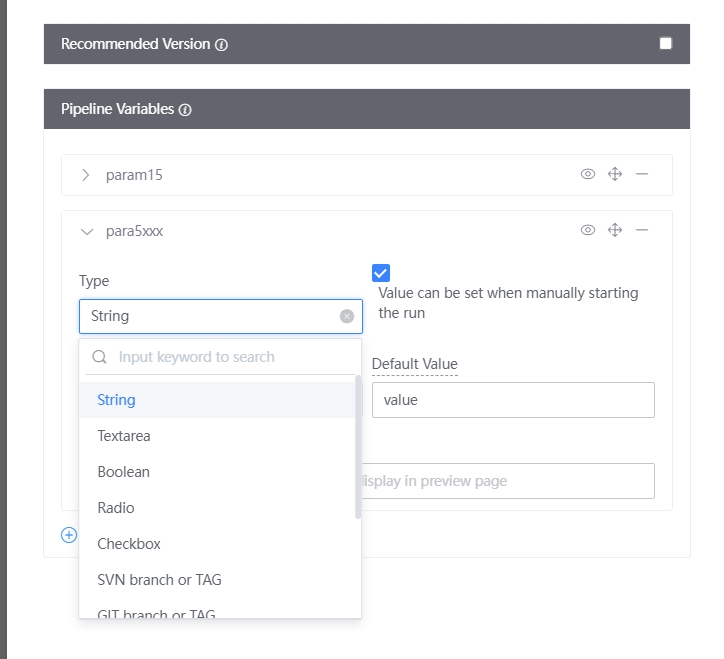
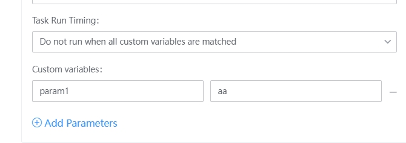
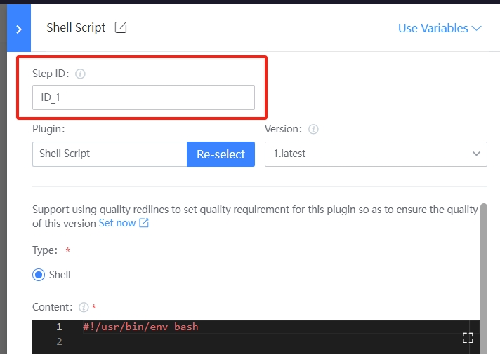

 # Customize pipelineVar 

 In the process of arranging Pipeline, general Set and Parameter dynamic changed in the Run process can be extracted as pipelineVar. 

 ## Customize Pipeline Global Variables in Orchestration 

 click Job1-1 on the edit Pipeline page to append pipelineVar. 
  


 ## (Recommended) Use `set-variable` to Set Global Variables in Bash/RunScript Plugin 

 You can Set the Parameter passed between plug-ins by approve the specific syntax `echo "::set-variable name=<var_name>::<value>"` in the Shell Script Plugin. The Usage is as follows: 

```bash
#!/usr/bin/env bash
# echo "::set-variable name=<var_name>::<value>"
# eg:
# echo "::set-variable name=fooBarVarName::fooBarVarValue"
```


 - set-variable is also Set as a **Global Variables**. If two Bashes set variables with the same name concurrently, the setting result is unpredictable 

 var Set approve this method are referenced downstream by Expression: ${{ variables.fooBarVarName }} 

 - When it is referenced in the Flow control condition of stage/job/task, it is also referenced approve variables.xxx For example: 

  

 ## (Recommended) Use `set-outputs` to Set the Output of the corresponding step in the Bash/RunScript Plugin 

 You can Set the parameters passed between plugins by using the specific syntax `echo "::set-output name= :: "` in the Shell Script Plugin<output_name><value>.  The Usage is as follows ：

```bash
#!/usr/bin/env bash
# echo "::set-output name=<output_name>::<value>"
# eg:
# echo "::set-output name=outputVarName::outputVarValue"
```

 Output var Set approve this method will not be Overwrite by the output of any step with the same name. 

 When using this method, you need to Set the id of the corresponding step: 

  

 This var is referenced for downstream step: 

 - When accessing the Output outputVarName of the preceding step_set_var of job1 in job2:${{ jobs.job1.steps.step_set_var.outputs.outputVarName }} 
 - When accessing the Output outputVarName of step_set_var under the current job in job2, you do not need to add the jobs context and directly refer to it through steps: ${{ steps.step_set_var.outputs.outputVarName }} 
 - When referenced in the Flow control condition of stage/job/task, the Name also needs to be setting in the format of jobs.job1.steps.step_set_var.outputs.outputVarName 

 job id is Manage on that job setting: (The system has set One defaultValue, which can be Revise to the ID you want. It is required to ensure that it is unique under the Pipeline) 

  
