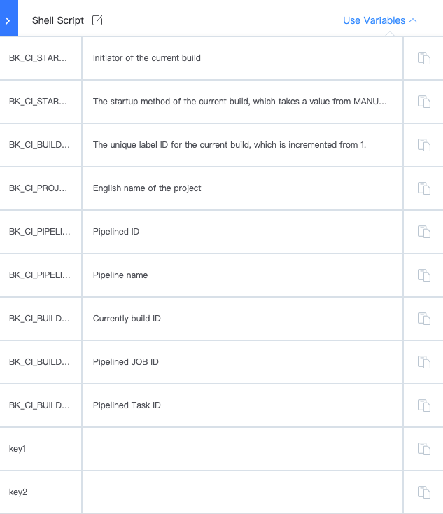

 # PipelineVar 

 In the pipeline, the user can use system constants/var or customVar to complete the buildTask or control the flow of the pipeline. 

 ## System constants/var 

 System constants/var usually start with BK_CI_ and are referenced by `${{name}}`.  Can be referenced in most pipeline plugin input parameters. 

 Some starred system constants/var can be obtained in the "useParams" in the upper right corner of the pipeline plugin edit page, as shown below: 

  

 The complete system constants/var can be viewed: 

 - [Predefined Constants/var](../../../../intro/terminology/pre-define-var/README.md) 

 ## CustomVar 

 - [customize pipelineVar](./variables-custom.md) 
 - [useParams in pipeline](./variables-custom-use.md) 

 ## You can also check out more var usage: 

 - [Basic use of var](./pipeline-variables-shell-batch.md) 
 
 - [Using var to control pipeline flow](./pipeline-variables-flow-control.md) 

 - [Voucher var](./pipeline-variables-ticket.md) 

 - [Use remark var](./pipeline-variables-remark.md) 