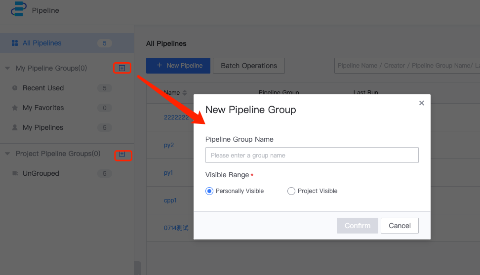
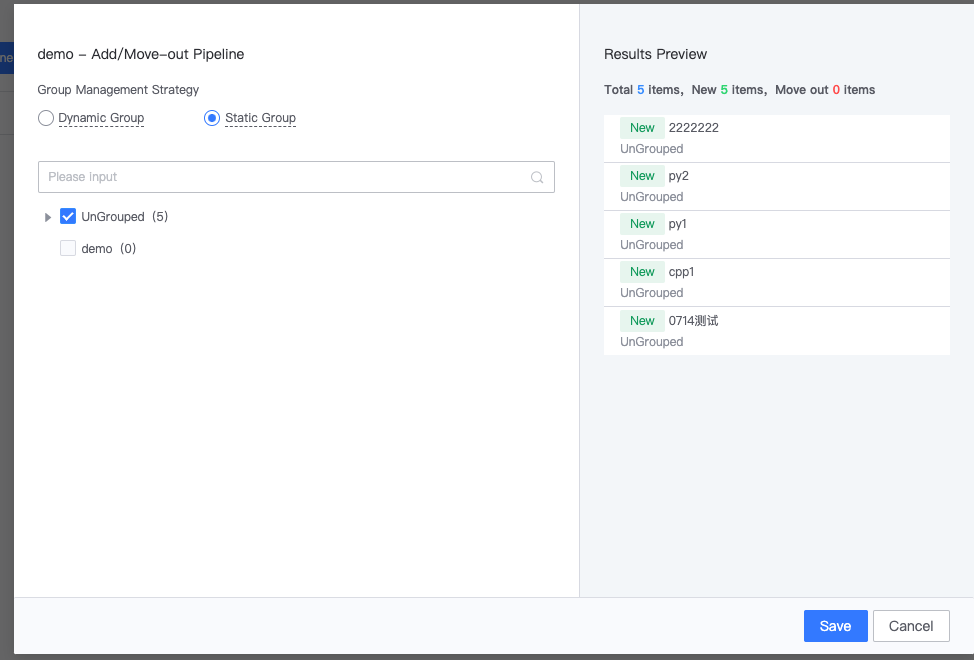
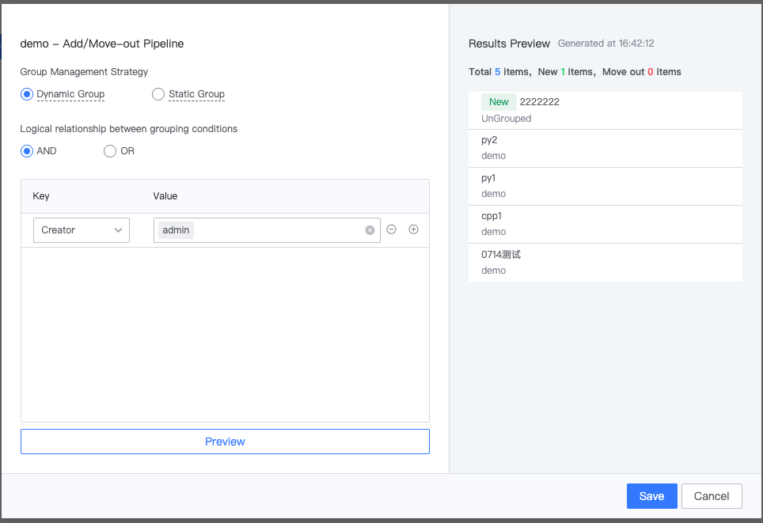
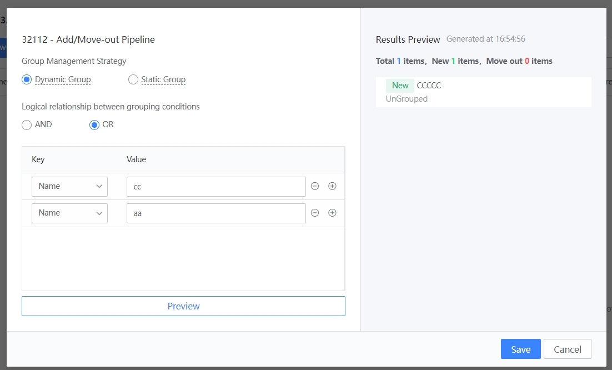
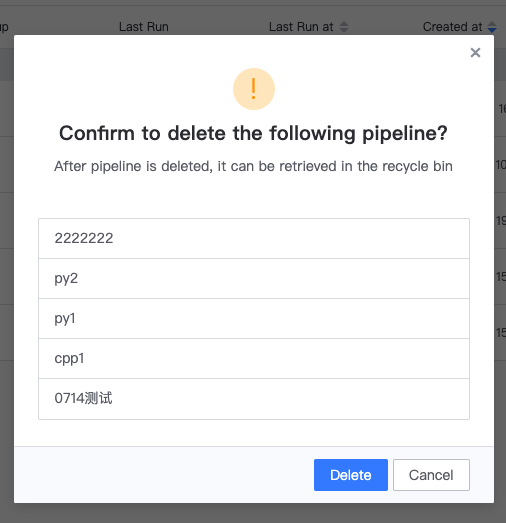

 # Pipeline Group 

 As the project develops, the amount of pipelines increases day by day. In order to allow you or the project members to easily find the required pipelines in a variety of pipelines, you can use pipelineGroup function to manage the pipelines by service classification. 

 By default, the left side of the Pipeline Home is divided into "personalViewList" and "projectViewList". 
 - Any personalViewList project can be created and is only visible to itself. 
 - projectViewList can be created only by ProjectManager, and will be visible to all project members after creation 

  

 ## AddPipelineGroup 

 Click on the plus sign in the image to add the PipelineGroup: 

  

 ## PipelineCountEdit Pipeline 

  

 pipelineGroup is divided into two groupStrategies: "staticGroup" and "dynamicGroup 

 grouping: precise manual assignment of pipelines within a group 

 Grouping: Set pipelineName, creator, pipeline label and other conditions, the pipeline is dynamically grouped into a group; 

 ### Append pipeline to staticGroup 

  

 ### Remove pipeline from staticGroup 

  

 ### Append/removeFrom Pipeline in dynamicGroup 

  

 After revising the dynamicGroup conditions, if the pipeline in the original group does not meet the new conditions, it will be automatically removedFrom after saving: 

  

 ## PatchManage 

 Click on patchManage to open the Batch Operation page. 

  

 ### PatchAddTo 

  

 ### PatchDelete 

  