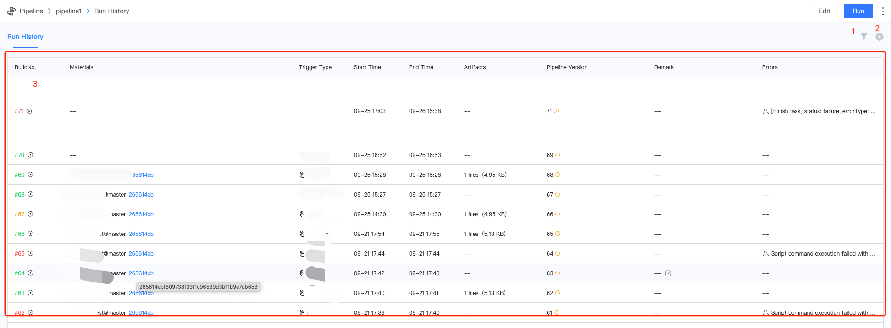

 # Pipeline buildTask pipelinesHistory 

 Each Pipeline has its own Task pipelinesHistory page, where you can quickly find CI Tasks. 

 ## Introduction to Function Area 

  

 1. filter: Pipeline buildTask can be filtered according to **Task Total, Code Repository, Branch** and other common Field 
 2. settingCols: If the default Table Field of pipelinesHistory does not satisfy you, don't worry, you can customize 
 3. pipelinesHistory: Each time a task is triggered, One Tasks will be generated. click each line to Enter the Details page. 

 ## Next you may need 

 * [BK-CI Navigation bar](../Console.md) 
 * [Pipeline List Page](pipeline-list.md) 
 * [create/edit Pipeline](pipeline-edit.md) 
 * [Pipeline Details Page](./pipeline-build-detail/pipeline-detail.md) 