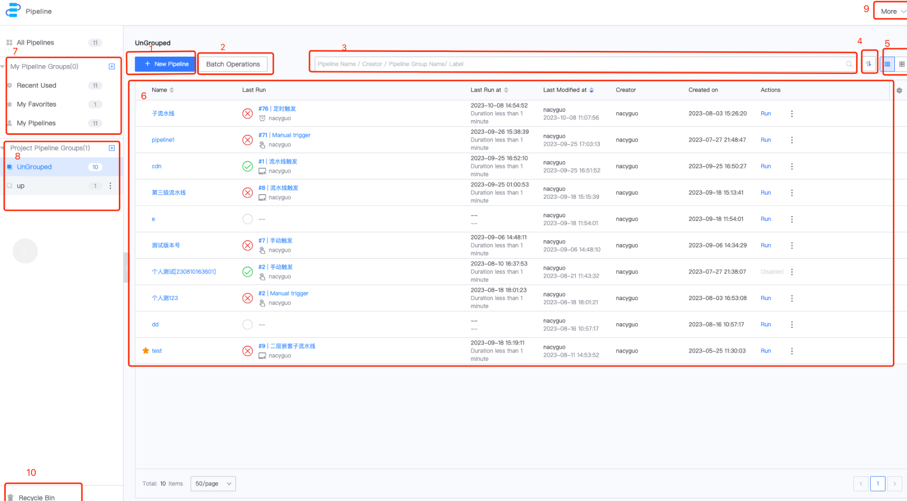

 # Pipeline List Page 

 The One page you switch to is the Pipeline List page, where you can find the usual entry points for Manage pipelines. 

 ## Introduction to Function Area 

  

 1. addPipeline 
 2. patchManage 
    - pipelineCountEdit: Batch Add. or remove pipelines to the current selected pipelineGroup 
    - patchDelete: delete One batch of Pipeline (if you have auth to delete) 
    - patchAddTo: Adds Pipeline batch to Other pipelineGroup 
 3. Filter: support filtering Pipeline According to name, creator and other conditions 
 4. order: support sorting According to name, creationTime, Change the time and lastExecTime 
 5. Pipeline tableLayout switching entry, supporting list mode and card mode 
 6. Pipeline, as shown in the tableLayout, One pipeline per line, can be execute in the Operation gateway, toCollect pipeline 
 7. personalViewList, personalView 
 8. projectViewList, projectView, ProjectManager can add, Revise 
 9. more service under the Pipeline 
    - labelManage 
    - templateManage 
    - pluginManage 
    - operatorAudit 
 10. recycleBin: Pipeline delete within 30 days can be restore from the Recycle Bin 

 ## Next you may need 

 * [BK-CI Navigation bar](../Console.md) 
 * [create/edit Pipeline](./pipeline-edit-guide/README.md) 
 * [Pipeline pipelinesHistory](pipeline-history.md) 
 * [Pipeline Details Page](./pipeline-build-detail/pipeline-detail.md) 