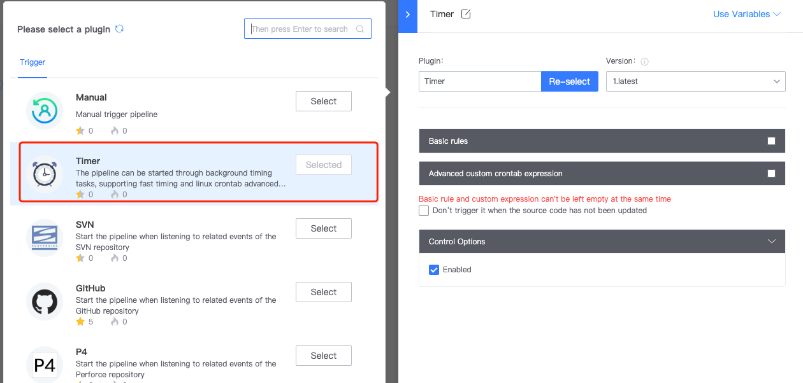
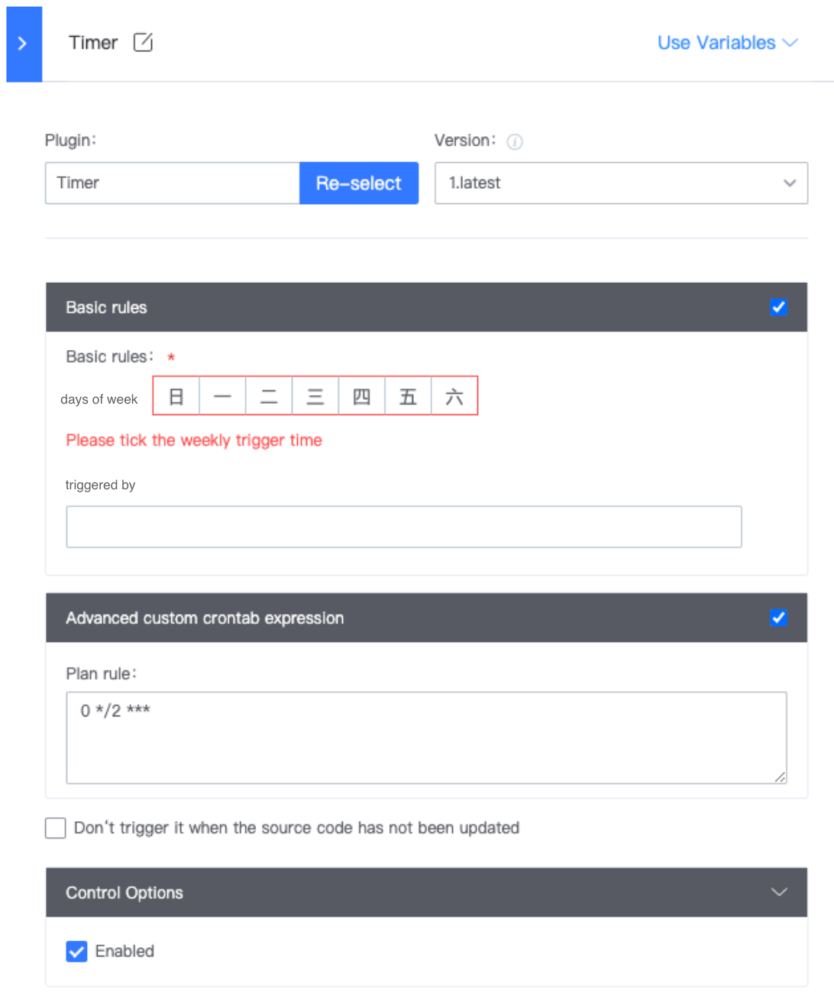

 # Scheduled triggerType 

 The Scheduled triggerType allows the user to trigger Pipeline at a specified time, which is suitable for Scene where you want to trigger the pipeline when the buildResource is idle (such as late at night).  The user can select both the baseRule and the crontab Expression, or both. 
 **Note:** The Trigger Time is based on the service time. It is recommended to adjust the BK-CI server Time zone to the user time zone. 

  

  