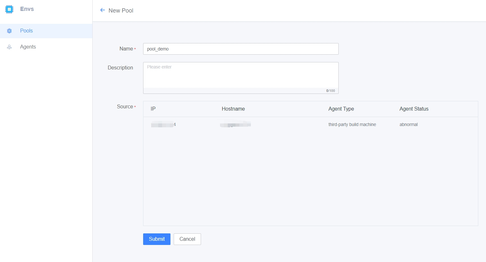
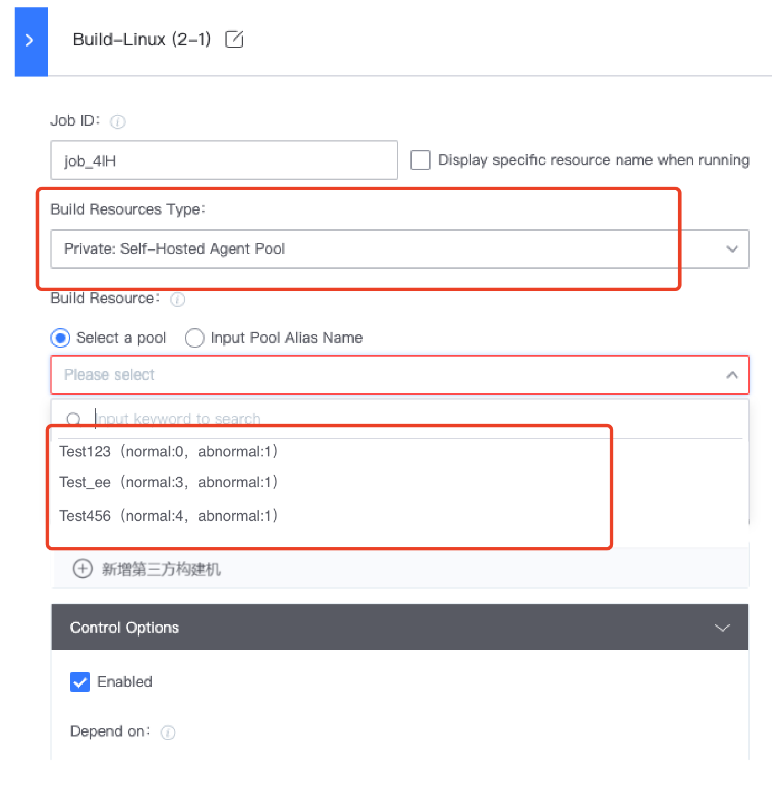

 # Build your own Self hosted agent resources 

 After importing your Self hosted agent into BK-CI, you can assemble One or more build machines into a pool of buildResource (createEnvrionment under BK-CI Pools). 

 It is Recommended to reference a Self hosted agent approve buildResource pool in the Pipeline. When the build machine is adjusted, you only need to adjust the corresponding environment updatePipelineJson. 

 The createEnvrionment page is as follows: 

  

 Once the environment is create, you can reference it in Pipeline: 

  