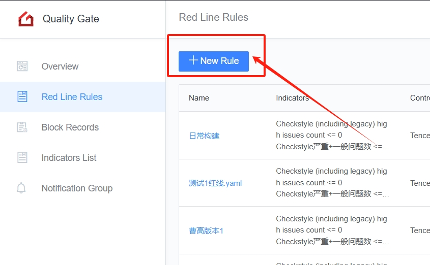
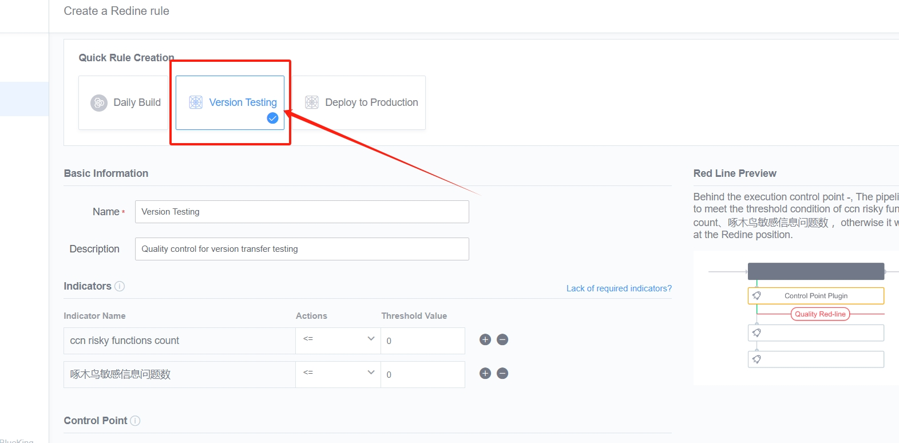
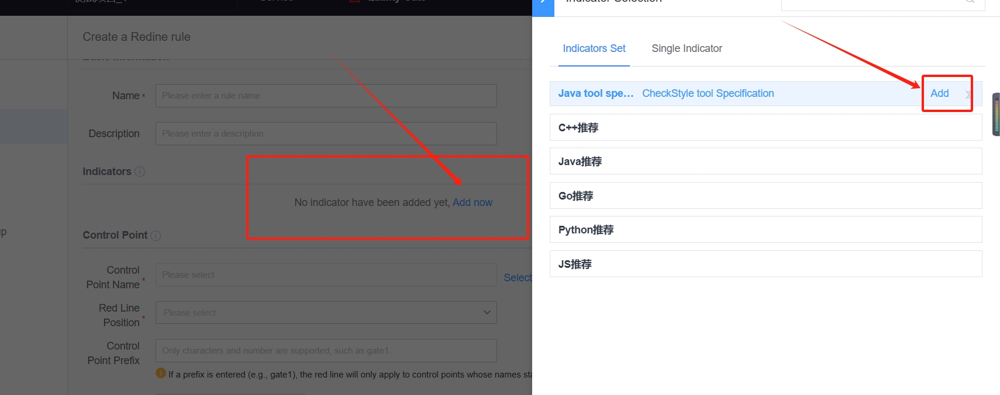
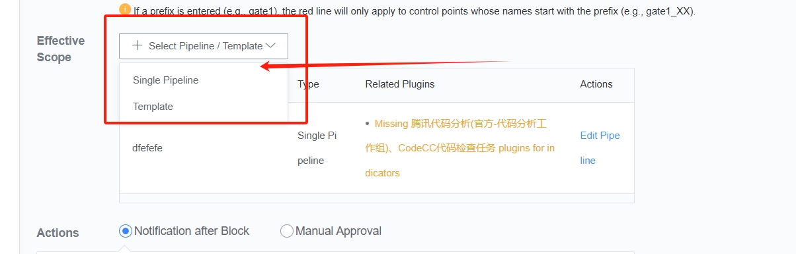
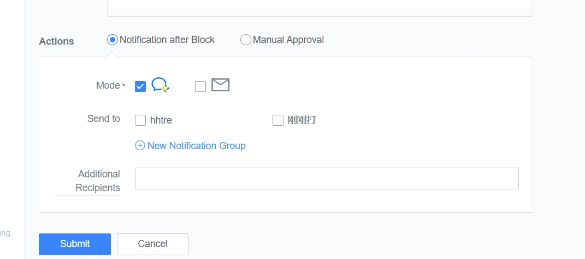
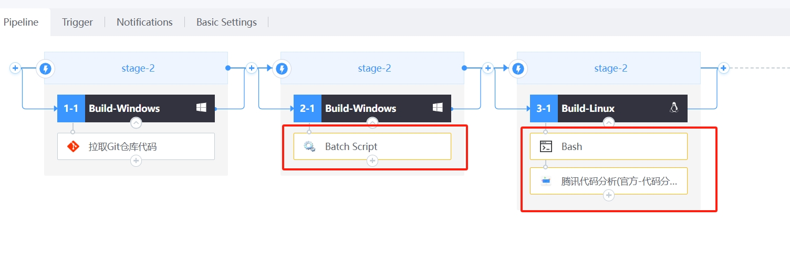
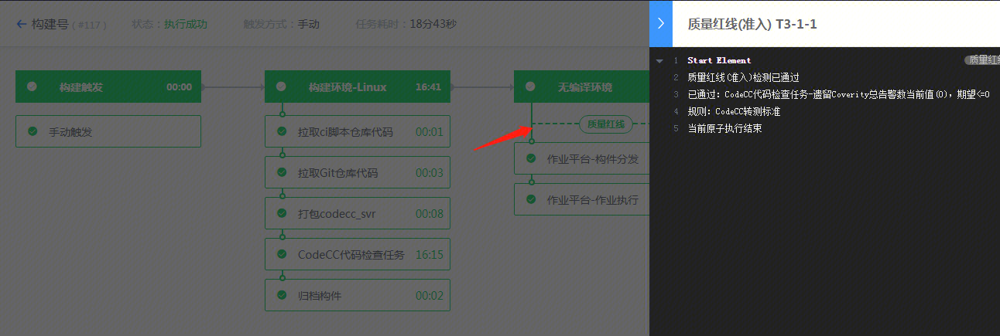

# Create quality redline rules

## step1 Enter quality red line service

Enter the quality redline service and choose to create a rule.

## step2 Select "Quick Create Rule"

According to your own needs, select a template in "Quick Creation Rules".

For example, if you want to implement quality red lines during transfer testing, you can select the "Version Transfer Testing" template. At this time the system will automatically create a rule for you.

> Indicators and control points can be modified and adjusted according to your own needs. If you don't find the indicator you need, you can also customize the indicator.

If you do not use a template, you can add indicators yourself:

## step3 Select "Effective Range"

Select the "validity range", which is the pipeline for which the above indicator threshold conditions will take effect. If the selected pipeline does not have related atoms/plug-ins for the output indicators, a prompt will be displayed. You can follow the prompts to add atoms/plug-ins to the pipeline.

## step4 Select the operation of the pipeline when red line interception

When the assembly line does not meet the quality standards defined by the quality red line, the assembly line will stop near the control point. We can set the pipeline to fail directly, or we can set it up to have the quality manager conduct a review to determine whether the pipeline should be allowed to perform subsequent steps, such as deploying to a test environment.

# Execute related pipelines

## The red line display effect of the assembly line

If the quality red line is set by the quality administrator on the pipeline, the corresponding control point in the pipeline will display a yellow border. Click to see the threshold and expectations of the quality red line.

## Execution pipeline

Code that does not meet quality standards will not be deployed successfully.

Code that meets quality standards will be deployed smoothly.

