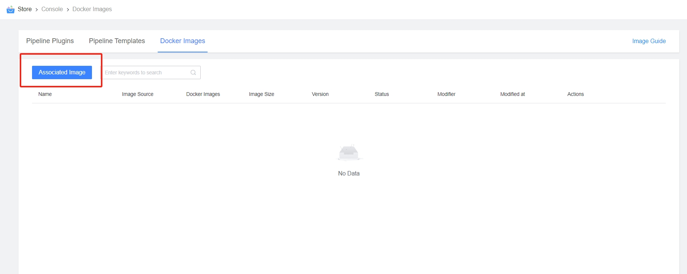
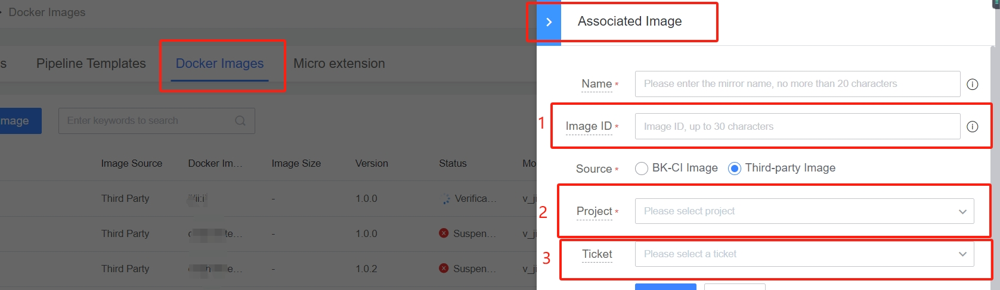
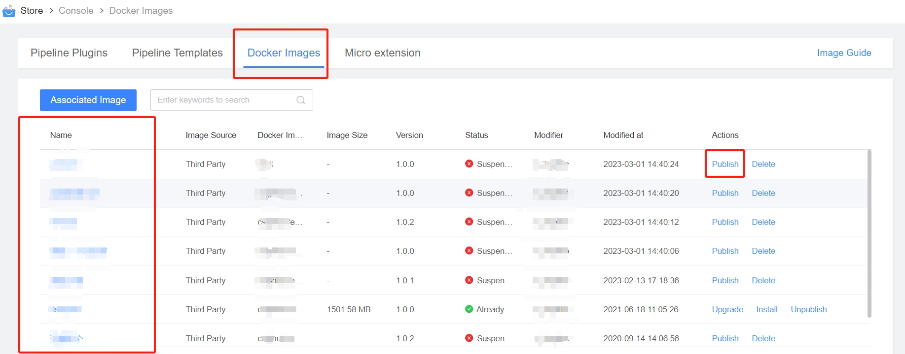
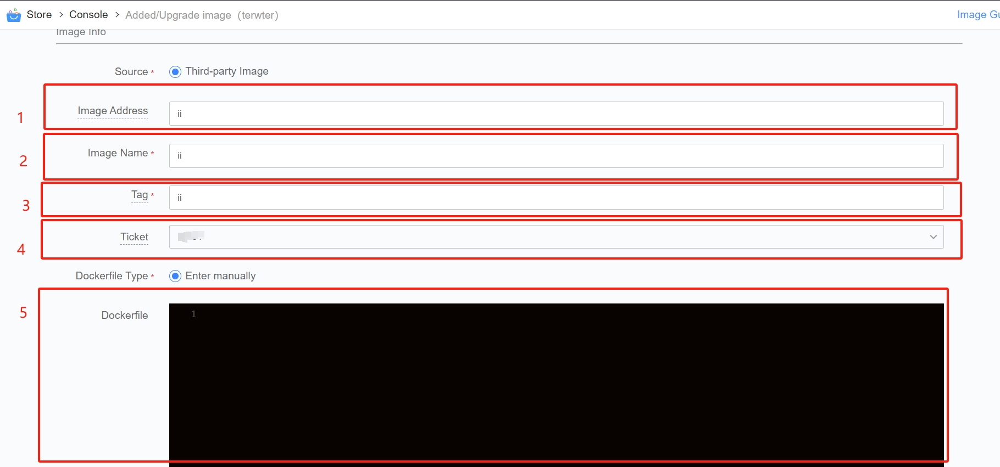
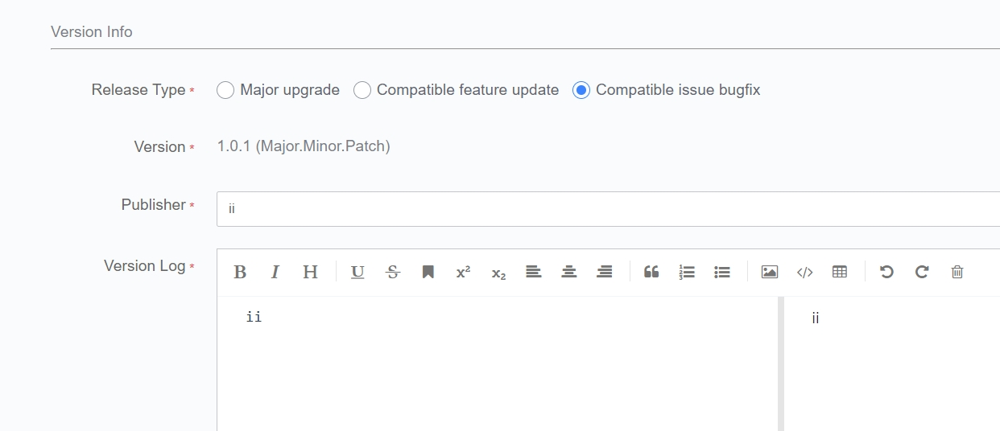
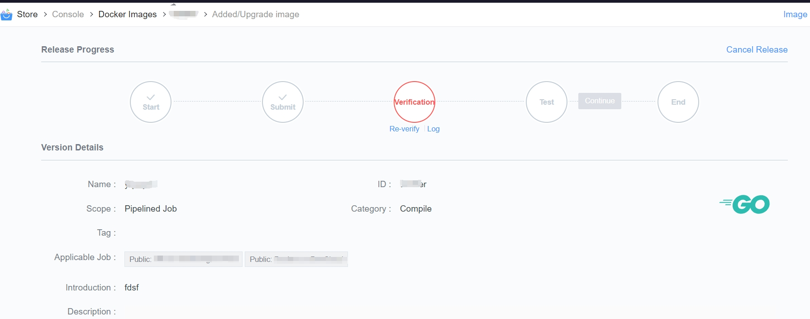

 # Release One container image 

 ## Preparing Container Image 

 If there is no image, please see [build and Host One CI Image](docker-build.md) 

 ## Release Container Images 

 ### Entry 

 Workbench-> Container Image-> link Image 
  

 ### link Images 

  

 1. The unique ID of the image in the store. It only needs to have the same name. 
 2. During image Release, you can verify whether the image functions normal under this Debug project.  It is recommended to use dedicated Test project verification 
 3. If it is a Private image, create One credential in credentialManage and link it with the image.  During execute, the system uses this credential to Pull image 

 ### Listing/Upgrading Images

 #### Entry is as follows 

  

 #### Fill In Basic Information 

  
  

 1. Image Library host 
    - If it is a docker hub image, you can leave it blank, or fill in docker.io 
 2. mirrorName, including image Namespace 
 3. mirrorTag 
 4. Credentials: Private images require specified access credentials 
 5. Dockerfile: It will be displayed in the store for user to learn the details of the image 

 When upgrading an image, there are Three upgrade modes: 
  

 1. Incompatible upgrade: 
    - Use when the image function logic is significantly changed and is incompatible with the old version 
    - After this type of Release, the Pipeline that Used The image will not be Auto Upgrade, and you need to Revise the versionNum manual 
    - versionNum +1 
 2. Compatible feature Update: 
    - Use when mirroring is Update or new (does not affect Used user) 
    - After this type of Release, the Pipeline that Used The image and whose versionNum selected as [majorVersion.latest] will auto use the New version without manual pipeline edit 
    - Minor versionNum +1 
 3. Compatibility bug fixes: 
    - Mirror function is compatible with old version, only fix problems 
    - After this type of Release, the Pipeline that Used The image and whose versionNum selected as [majorVersion.latest] will auto use the New version without manual pipeline edit 
    - Amendment No.+1 

 #### Verifying Image 

 After submit Release, you can verify that the image functions as expected under the Debug project 
  

 1. Test: click to location to the Pipeline service of the Debug project. You can use this image to execute the pipeline Job and verify whether the function meets the expectations 
 2. If a problem is found, Push the image, and then re-verify and Test 
    - The step of verifying the image is only to Check whether the image can be Pull Success. The publisher needs to test whether the function is normal. 
 3. Once the Test is OK, manual Continue the Release Flow to release the image to the store for use by Other user/project 