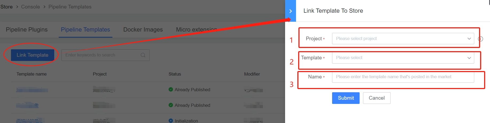
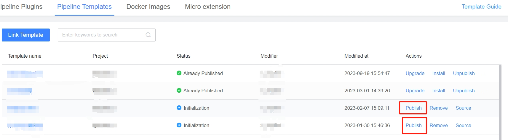
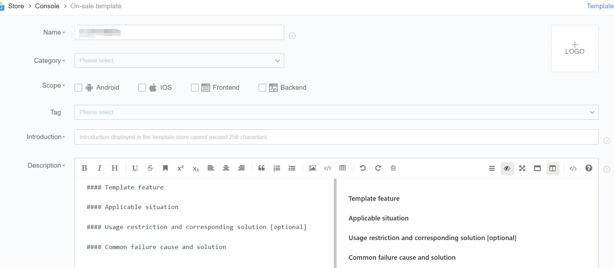

 # Release One Pipeline template 

 ## Release Entry 

 In the store workbench, the following entry link the template to the store 

  

 ## link Templates 

  

 1. Project Source Template 
 2. source template 
 3. The name of the template to Display after Release to the store 

 Note: Only One record in the status of Initialized will be Generate in the workbench after submit, and will not be Release to the store immediately 

 ## Release Template 

 submit listing/upgrade at the following entry: 
  

 You can Revise the template information during listing/upgrading: 
  

 Once Fill In and submit, the template is Release to the store. 

 ## Next you may need 

 * [createPipeline Using Template](../../../Quickstarts/case/Examples/create-pipeline-by-template.md) 