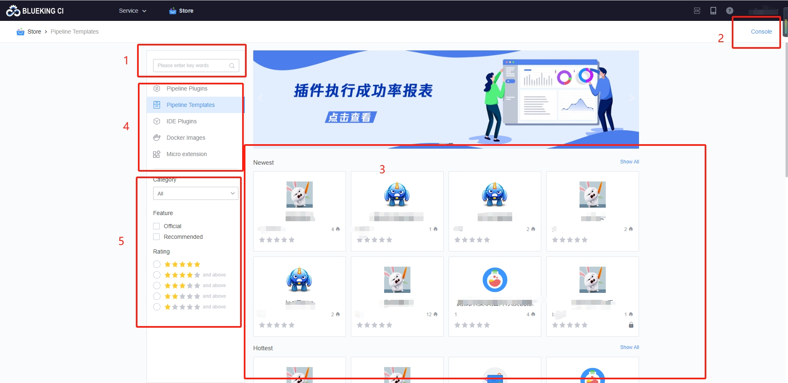

 # Store Home 

 The store provided the public resources needed to Run Pipeline: Plugin, templates, container images.  You can find Plugin that are suitable for your project. 

 ## Introduction to Function Area 

  

 1. search the current type of store resources approve keywords (see 4 for what Resource type you currently belong to) 
 2. Workbench entrance, you can Manage your own resources 
 3. current The resource list 
 4. Resource type, including Pipeline Plugin, pipeline template, and container image 
 5. resources filter 

 ## Next you may need 

 * [Develop One Pipeline Plugin](start-new-task.md) 
 * [Develop One Pipeline template](./ci-templates/start-new-template.md) 
 * [Release One container image](./ci-images/release-new-image.md) 