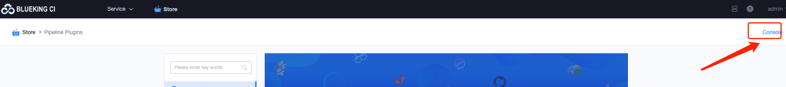
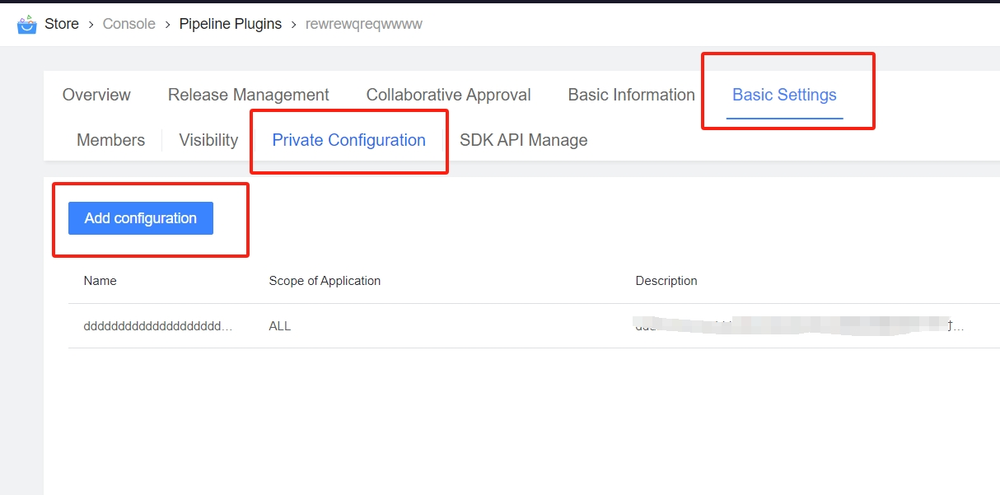
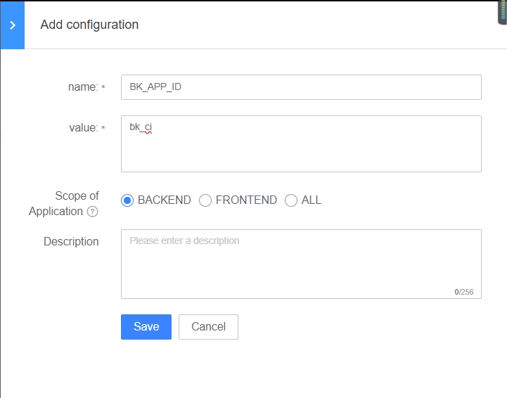
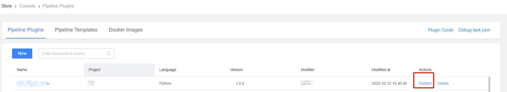
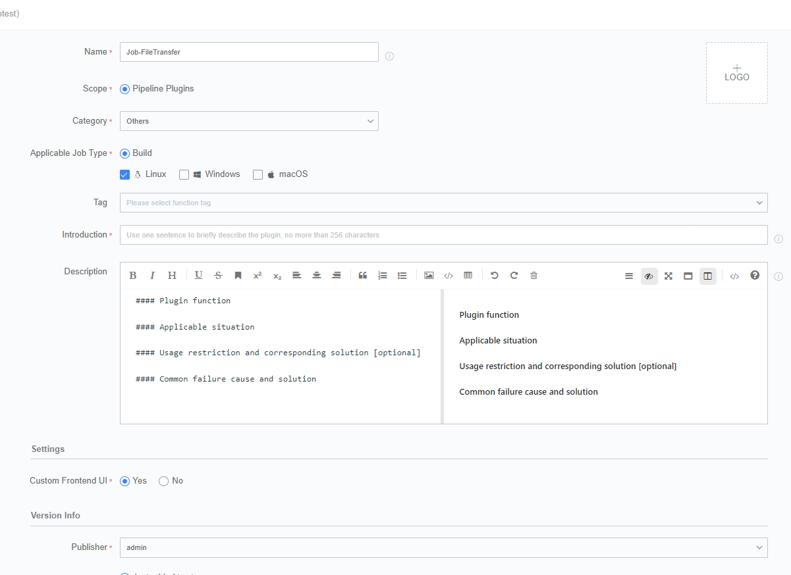
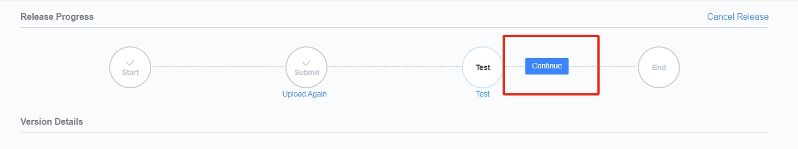
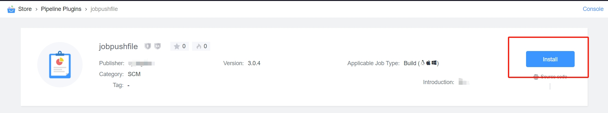

 # Starred Plugin install 

 This article will show you how to install the Plugin in BK-CI. 

 ## Download address of Starred Plugin 

 * **pushJobFile** 

 Distributing Artifact to target service using Job System 

 https://github.com/ci-plugins/pushJobFile 

 Compilation environment: noEnv 

 Development language: java 


 * **executeJob** 

 Invoking Job System execute jobs 

 https://github.com/ci-plugins/executeJob 

 Compilation environment: noEnv 

 Development language: java 


 * **executeJobScript** 

 Calling Job System execute Script 

 https://github.com/ci-plugins/executeJobScript 

 Compilation environment: noEnv 

 Development language: java 


 * **sendEmail** 

 > Send notification Email 

 https://github.com/ci-plugins/sendEmail 

 Compilation environment: noEnv 

 Development language: java 


 * **checkout** 

 > git Pull Code 

 https://github.com/TencentBlueKing/ci-checkout 

 Build environment: Build environment (Linux+ macOS + Windows) 

 Development language: java 


 * **sendmsg** 

 > 1. Send WeCom message (ESB setting required) 
 > 2. Send Email messages (ESB setting required) 
 > 3. Send WeCom group message 

 https://github.com/wenchao-h/bkci-plugin-sendmsg 

 Build environment: (Linux + Windows + MacOS) 

 Development language: Python 

 --- 

 ## Install step 

 Take install **pushJobFile** Plugin as an example. The installation step are basically the same. 

 ### One. downloadInstallationPackage 

 Download the install package According to Plugin download address. 

  

  

 --- 

 ### Two. Enter the workbench 

 path: 

 BK-CI-----> store----> Workbench 

  

 --- 

 ### Three. addAtom 

  

 name: can be customize. 

 Identity: Must be the same as the fileName of the Plugin installation package to be install.  The case Must also be consistent. 

 Debug project: select the project to debug the Plugin. 

 Development language: Select the language for Develop Plugin. 

 customize front-end: If no custom front-end is required, select No for both. 

 --- 

 ### Four. Plugin Config 

 The setting required for the Plugin is described on the GitHub page.  https://github.com/TencentBlueKing/ci-pushJobFile 

 pushJobFile needs to be setting: 

 1. Plugin Config 
 When the Plugin is put on the shelf, you need to setting the relevant Parameter of BlueKing. path: Set-> Private setting 

 2. Job System setting 
 Please add all the machine IPs of the BlueKing CI backend service artifact factory to the IP whiteList of the Job System, and setting them in the "Platform Manage->IP Whitelist" of the operation platform. The Effective Range selectFile distribution. If the artifact capacity, the IP of the expanded machine needs to be Update to the whitelist. 


 **Plugin Config** 

 When the Plugin is put on the shelf, you need to setting the relevant Parameter of BlueKing. path: Set-> Private setting 

  

 In the BlueKing console, According to the guidelines in GitHub to get the relevant var. 

 ``` 
 source ${CTRL_DIR:-/data/install}/load_env.sh 

 echo "BK_APP_ID      $BK_CI_APP_CODE" 
 echo "BK_APP_SECRET  $BK_CI_APP_TOKEN" 
 echo "ESB_HOST       $BK_PAAS_PRIVATE_URL" 
 echo "JOB_HOST       $BK_JOB_PUBLIC_URL" 

 #Reference Output 
 BK_APP_ID      bk_ci 
 BK_APP_SECRET 
 ESB_HOST       http://paas.service.consul:80 
 JOB_HOST       http://job.bktencent.com:80 
 ``` 

 After obtaining the var, ** new setting ** and fill in the variables 

  


 **Job System setting** 

 Please add all the machine IPs of the BlueKing CI backend service artifact factory to the IP whiteList of the Job System, and setting them in the "Platform Manage->IP Whitelist" of the operation platform. The Effective Range selectFile distribution. If the artifact capacity, the IP of the expanded machine needs to be Update to the whitelist. 


 1. Get the IP of the artifactory machine in the central control machine first 

 cat /data/install/install.config| grep artifactory 


 2. In the Job System, add the IP to the whiteList 

  

  

 --- 

 ### Five. Plugin for Listing 

 After the setting is complete, Return the workbench and select the Plugin to be put on the shelf 

  

 Fill In the information and upload the Plugin install package obtained from GitHub 

  

 click submit to Enter the Plugin Test Stage.  The Plugin here have been Develop. click **Continue** to SKIP the Test. 

  

 The Plugin **pushJobFile** has been Success added to the store. You can install the plug-in. 


 --- 

 ### Six. install the Plugin 

 After the Plugin is Success launched, the plug-in can be install.  The corresponding plug-in can only be used for project that have the corresponding Plugin install. 

 "store"-"click the corresponding Plugin"-"install"-"select the corresponding project"-"Install" 


 **Enter the store and select the corresponding Plugin** 

  

 **select install Plugin** 

  

 **select the project to install the Plugin to** 

  


 The Plugin **pushJobFile** has been Success complete. You can install Other plug-ins According to this method. 