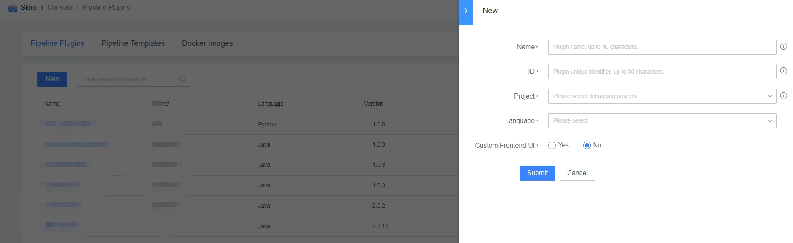

 # Develop One Pipeline Plugin 

 > Before Develop a Plugin, Enter the plug-in workbench to initialize One plug-in and determine the unique ID of the plug-in in the platform 

 ## Workbench 

 You can new/Release/archive Manage Plugin here 

 ### Introduction to the Function Area 

  

 1. Toggle Resource type 
 2. addAtom 
 3. Manage portal for individual Plugin 
 4. entry for upgrading, archive and delete Plugin 
 5. Guide The document and Plugin UI Debug tool entry 

 ### AddAtom 

  

 1. identification 
    - The unique identifier of the Plugin in the platform. It is recommended to use the English identifier related to the plug-in function with good readability. 
 2. Debug project 
    - During the Plugin Release process, you can append the plug-in to the Pipeline runs under the Debug project to Test the plug-in and ensure that the plug-in function meets the expectations. 
    - It is recommended to new a dedicated Plugin Debug project to avoid affecting Business Name during Test. 
 3. Development language 
    - Support Four languages Develop Plugin: 
        - Java (Recommended) 
        - Python 
        - Golang 
        - Nodejs 

 ### Develop Plugin 

 > After initializing the Plugin, you can start Develop the plug-in  
 - Refer to the corresponding development guidelines according to the Development language 
  - [Java Develop Plugin Guide](../../Developer/plugins/plugin-dev-guide/java.md) 
  - [Python Develop Plugin Guide](../../Developer/plugins/plugin-dev-guide/python.md) 
  - [Golang Develop Plugin Guide](../../Developer/plugins/plugin-dev-guide/golang.md) 
  - [Nodejs Develop Plugin Guide](../../Developer/plugins/plugin-dev-guide/nodejs.md) 

 ### Plugin Private setting 

 > Plugin level Sensitive information, such as token, username password, IP, domain name, etc., is not recommended to be submit directly to the Code Repository, and Manage approve the workbench Private setting interface 

 The entry is as follows. After create, you can use the method provided by SDK in the Plugin to obtain the 
  

 ## Next you may need 

 - [upload One Pipeline Plugin](upload-new-task.md) 