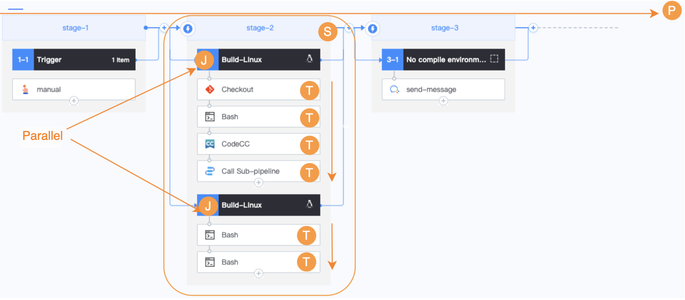
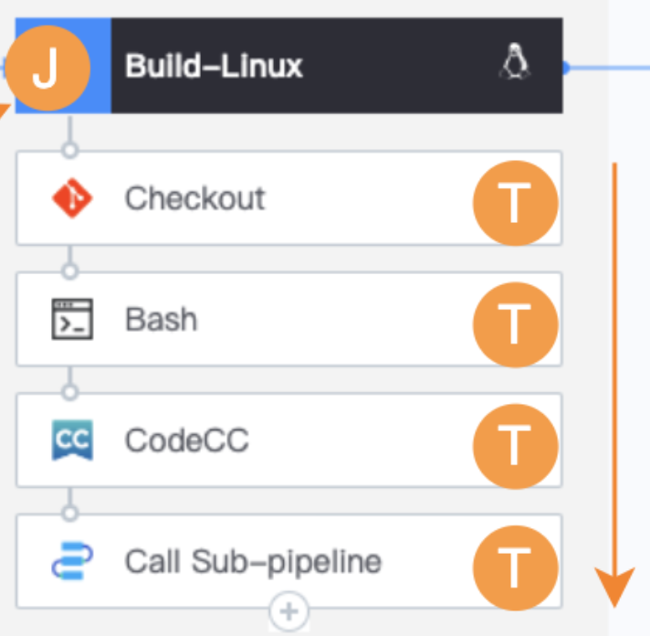

 # 5 minutes to understand the BK-CI Pipeline 

 BK-CI can help you quickly implement One continuous delivery Pipeline to build, Test, and Deploy your Apply. Here approve tutorials and The document guides on how to setting and Manage a continuous integration and continuous delivery (CI/CD) pipeline in BK-CI. 

 The following is the complete logic diagram of Pipeline: 

  

 ## Task (Plugin) 

 One separate Task, such as pulling Code from a GitHub repository. 

 ## Job 

 It can Run in One buildEnvType, such as macOS. It can also be scheduled as a Normal Task that does No Need a buildEnvType.  It has the following characteristics: 

 - Composed of multiple Tasks(Plugin) 
 - One Task failed, The Job fails and the remain tasks do not Run 
 -  

 ## Stage 

 - Consists of several jobs 
 - Jobs in the same Stage are execute in parallel, and jobs are independent of each other 
 - When One Job failed, The Stage fails 
 -  

 ## Pipeline 

 - Consists of multiple stages 
 - Stages under the same Pipeline are execute serially. If One Stage failed, the subsequent Stage will not be executed 
 - When One Stage failed, The Pipeline fails 

 Materials and Triggers 

 ## material Materials 

 Pipeline runs is like cooking, you need materials (rice), with materials, you can make delicious meals.  After append the relevant Plugin (Git, SVN) that Pull Code Repository to the Pipeline, the pipeline has the material. 

 ### Trigger 

 That is, the triggerType of Pipeline build currently includes: Manual triggers Scheduled triggers, Code Repository event, and Remote triggers 

 ## Others 

 ### Output 

 execute One Pipeline is build, there will be many outputs, which are Service Classification According to the following Dimension: 

 - artifactory (Artifact) 
 As the name implies, it is a Two file generated after compilation or packaging, including images, version Compressed package, IPA packages, APK packages, etc. With Plugin, you can Archive artifactory to a specified repository. 

 - Code Analysis report 

 If your Pipeline includes the Blueking Code Check Center Code Analysis Task Plugin, your pipeline will have One code inspection report page data be reflash as your pipeline build execute. 

 - Test report 
 - install program 
 - ChangeLog 
 - The document 

 > If you want to Shared output between different jobs, you need to use the "Upload" and "Download" Plugin. 

 ### WORKSPACE 

 The working directory on the builder is the relative directory of all Plugin related to the builder when they are execute. In the following plug-ins that require a path, the relative path under WORKSPACE is also required. 

 ### node 

 Also known as a agent, in order to compile, Test, or Deploy your Code, you need to import at least one Agent node into BK-CI, and this number will grow as your team increased.  Depending on the nodeType, our Task are also divided into two categories: 

 - Run directly on the node 

 You can directly select a Self hosted agent (including macOS, Windows, Linux) import into BK-CI when append a Job, and the Pipeline will assign the Task to The build machine when Run to the corresponding Job. 

 - Run in the node's docker 

 When The operating system of your node is Linux, there is One additional options for ** resourceType ** on the Job detail page: Linux Build Image.  If this options is selected, Pipeline will make full use of your node's CPU, MEM and other dynamic resources after Run to The Job approve the following ways: 

 - Run the docker run command on the node assigned to The Job to Start Up the corresponding image. 
 - Mount WORKSPACE into docker to compile build 
 - After the Run finished, destory The container and keep it in WORKSPACE 

 ## Next you may need 

 learnMore Base concepts to help you quickly setting the Pipeline for your Business Name Scene: 

 - [Task](Task.md) 
 - [Job](Job.md) 
 - [Stage](Stage.md) 
 - [Variables](Variables.md) 
 - [Triggers](Triggers.md) 