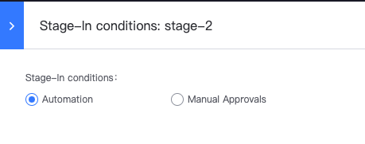
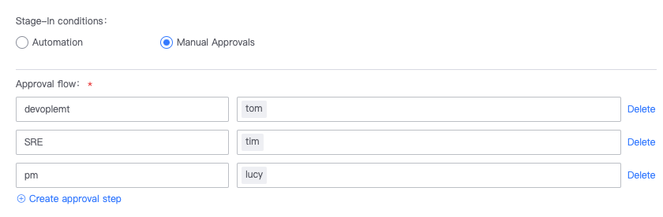

 # Stage 

 In order to description the CI Flow more clearly, we introduce the concept of Stage. 

 - Consists of multiple Jobs; 
 - The execute mode of jobs in the same Stage is parallel. Because jobs are independent of each other, after a Job failed, other jobs will be Run to complete; 
 - One Job failed, The Stage fails. 

  

 ## Stage allowEnter 

 If your Pipeline needs to interrupt the Flow and introduce an toCheck mechanism, then Stage allowEnter can meet your needs and support the approval process in your process. 

 ### How to use 

 - click Lightning ICON on the left side of Stage 

  

 - In the pop-up box, change the stageInConditions to "Manual toCheck"(default is "auto", i.e. no approval). 

  

 - Set the corresponding approval process (each approval process can contain multiple approval phases. If multiple people are involved in One approval phase, the next approval phase can be Enter after approval by any one person) 

  

 ### Advance Game 

 - Pipeline Task can be protected approve Set stageTimeoutLabel. If the approval is not performed after the time limit, the approval is deemed as Fail, and the pipeline Enter the status of STAGE_SUCCESS, and the Flow terminate. 
 - It can be Revise during toCheck approve Set "stageReviewParams" to change pipelineVar, and then affect subsequent Flow in coordination with conditional execute of Job/Task. 

 ## general options for Stage 

 ### Fastkill 

 After Fastkill is enable, stageFastKillDesc. 

 ### jobOption 

 approve Advance Flow control, you can definition the logic for the Job to run. 

  

 ## Next you may need 

 - [Task](Task.md) 
 - [Job](Job.md) 