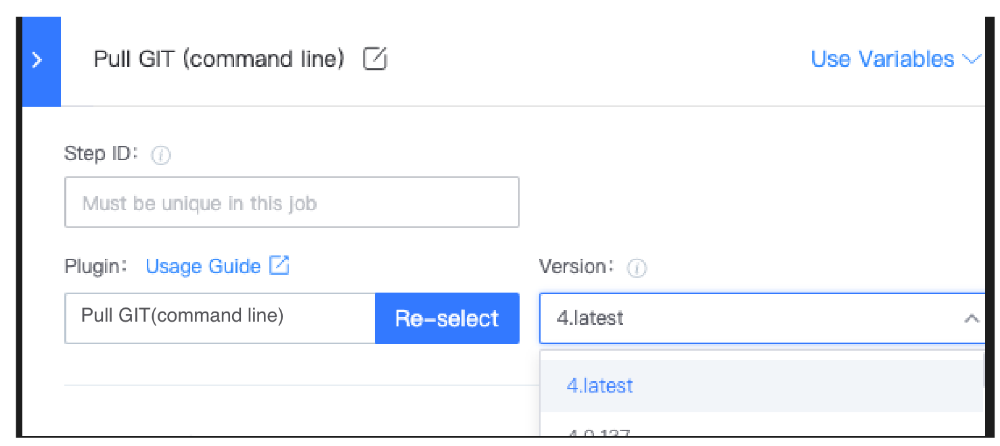
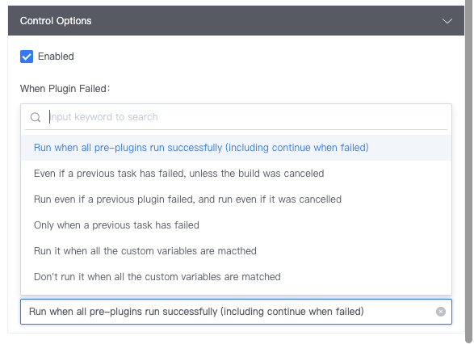

 # Task 

 A Task, also known as Pipeline Plugin, is usually One single Task, such as Pull Git repository Code. 

 Tasks Must be included in [Job](Job.md). Tasks in the same Job are execute sequentially from top to bottom (except for tasks with Advance Flow control Enable). 

 ## customize Plugin 

 approve the store, you can Develop your own Plugin, which are currently supported in Java/Python/NodeJS/Go. Start developing your One Pipeline Plugin. 

 ## Plugin version 

 Each Plugin has version control, and you Must specify One Version (s) when using a plugin. 
  
 > Plugin version specification: 
 > 
 > -Default to the The latest version of of the current plug-in each time a Add plugin 
 > -added Plugin, if the versionNum contains N.latest, if the Develop Plugin released new minorVersion containing N, the New version will be used auto 

 ## general Plugin options 

 ### Advance Flow Control 

 approve Advance Flow control, you can definition the logic for the Plugin to run. 

  

 ### atomOutput 

 After each Plugin is Run, it will produce One series of Output var. approve the effective combination of variables and Advance Flow control, various Apply Scene can be realized. 
  
 outputNamespace: 
 > Used to solve the problem of conflict Output Field usage when multiple instances of the same Plugin exist in the Pipeline. 
 > 
 > -No need to append Namespace when there are no conflict 
 > -When the Namespace is Revise, the subsequent use of the corresponding Field also needs to be synchronized 

 ## Next you may need 

 - [Job](Job.md) 
 - [Stage](Stage.md) 